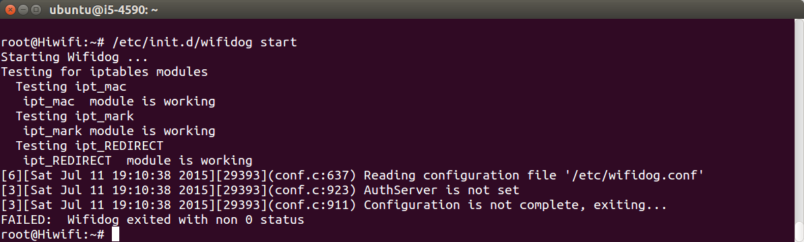
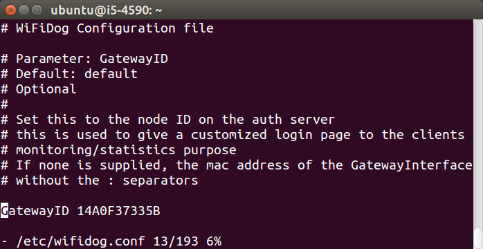
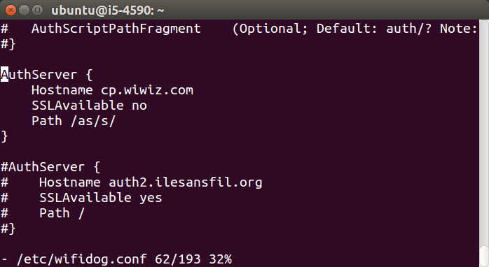
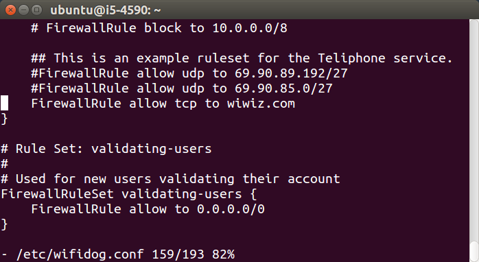
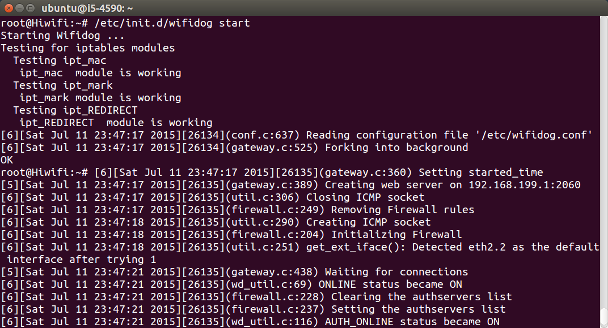

# 编译一个包 How to Build a Single Package

## 准备编译环境 prerequisites

OpenWrt是Linux，所以使用Linux系统进行开发很方便。本文档使用Ubuntu系统（官网：[ubuntu.com](http://www.ubuntu.com/download/desktop)，国内镜像下载：[mirrors.163.com](http://mirrors.163.com/ubuntu-releases/)），建议使用最新稳定版。如果用的是Windows或macOS，可以用免费的虚拟机Virtual Box（官网：[virtualbox.org](https://www.virtualbox.org/)，国内镜像下载：[gmirror.org](http://gmirror.org/#virtualbox)）安装Ubuntu。

在Ubuntu系统中执行下列命令，安装依赖：

```
sudo apt-get install build-essential ccache flex gawk gettext git liblzma-dev libncurses5-dev libssl-dev python subversion u-boot-tools unzip wget xsltproc zlib1g-dev
```

## 下载OpenWrt SDK

如果路由器厂商提供了专用的OpenWrt SDK，那是最好的，优先使用。有这些厂商提供了：

极路由：[http://doc.hiwifi.com/docs/sdk_usage](http://doc.hiwifi.com/docs/sdk_usage)

如果下载链接失效了，请向厂商反馈。或者在本站进行挖掘（[dl.openwrt.io](http://dl.openwrt.io/)），因为本站已经把它们都下载下来了。

本文档继续以极路由为例，下载解压缩到`~/openwrt/hc5761`。

```
mkdir ~/openwrt/
cd ~/openwrt/
tar -zxvf ~/Downloads/hc5761-20140619.tar.gz -C ./
```

## 下载包代码并编译 compile package

以wifidog为例，由于极路由软件源中的wifidog版本太旧，所以需要自己下载编译新版。

下载：

```
cd ~/openwrt/
git clone git://git.coding.net/openwrtio/packages.git
ln -s ~/openwrt/packages/net/wifidog ~/openwrt/hc5761/package/
```

进行菜单配置，选中wifidog这个包（在Network-\>Cative Portals中）：

```
cd ~/openwrt/hc5761
make menuconfig
```


编译：

```
make package/wifidog/compile -j V=99
```


可以看到编译的结果是一个ipk文件，在bin目录中。把它上传到路由器中，尝试安装。

```
scp bin/ralink/packages/wifidog_1.2.1-2_ralink.ipk root@192.168.199.1:/tmp/
ssh root@192.168.199.1
opkg update
for filename in `grep -lr wifidog /var/opkg-lists/`; do sed -i 's/^Package: wifidog$/Package: wifidog-deleted/g' $filename; done
opkg install /tmp/wifidog_1.2.1-2_ralink.ipk
```

## 启动软件 start package

尝试启动wifidog，将会报错：AuthServer is not set，然后退出。如图所示：

```
/etc/init.d/wifidog start
```



这是由于wifidog尚未配置，修改`/etc/wifidog.conf`，定位到15行，删掉行首的井号注释，修改GatewayID；定位到81行，删掉行首的井号注释，修改AuthServer；定位到243行，修改FirewallRuleSet global，内容如下：

```
GatewayID 14A0F37335B

AuthServer {         
    Hostname cp.wiwiz.com
    Path /as/s/
}

FirewallRuleSet global {
    FirewallRule allow tcp to wiwiz.com
}
```

如图所示：





然后启动wifidog，手机连上此wifi，访问任何网站都会跳转到认证页面，点击“立即开始使用此网络”，即可上网。如图所示：

```
/etc/init.d/wifidog start
```




## 编译所有包 compile all packages

编译所有包耗时很长，请自行尝试。指令如下：

```
sed -i 's/# CONFIG_ALL .*/CONFIG_ALL=y/' .config
make defconfig
make package/compile -i -j V=99
```

<div id="comments" data-thread-key="docs-build-a-single-package"></div>
