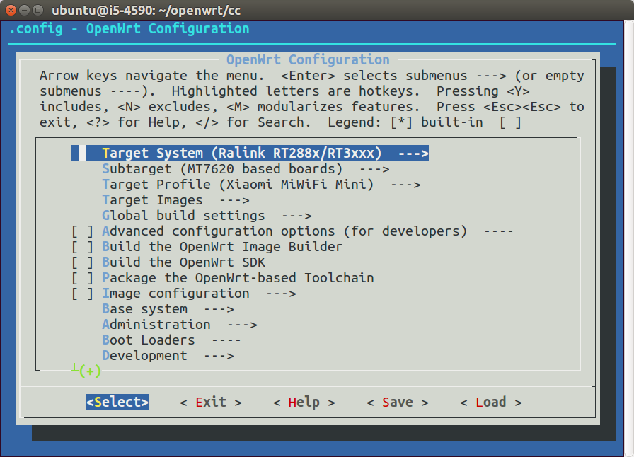
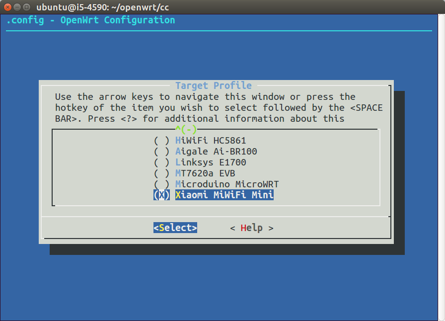
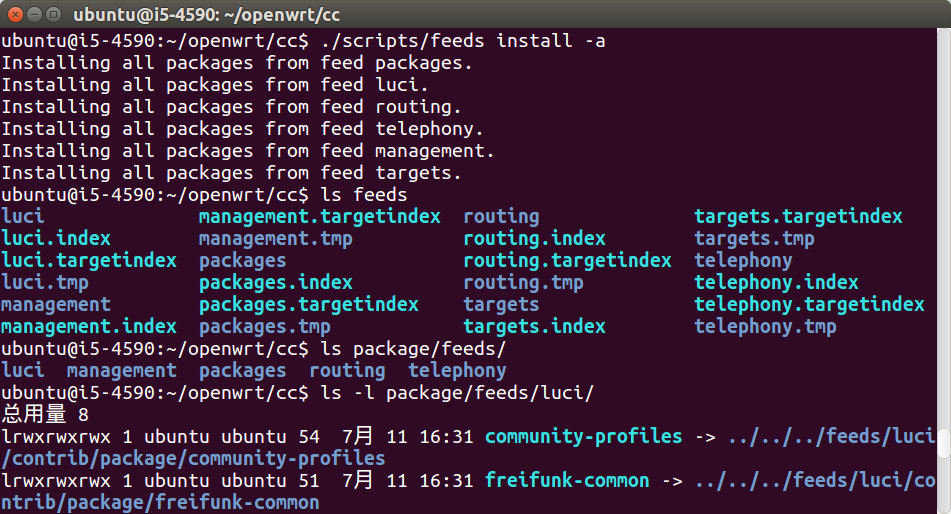
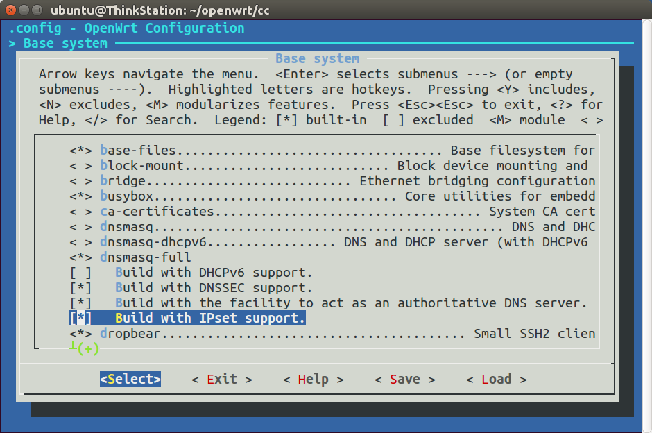
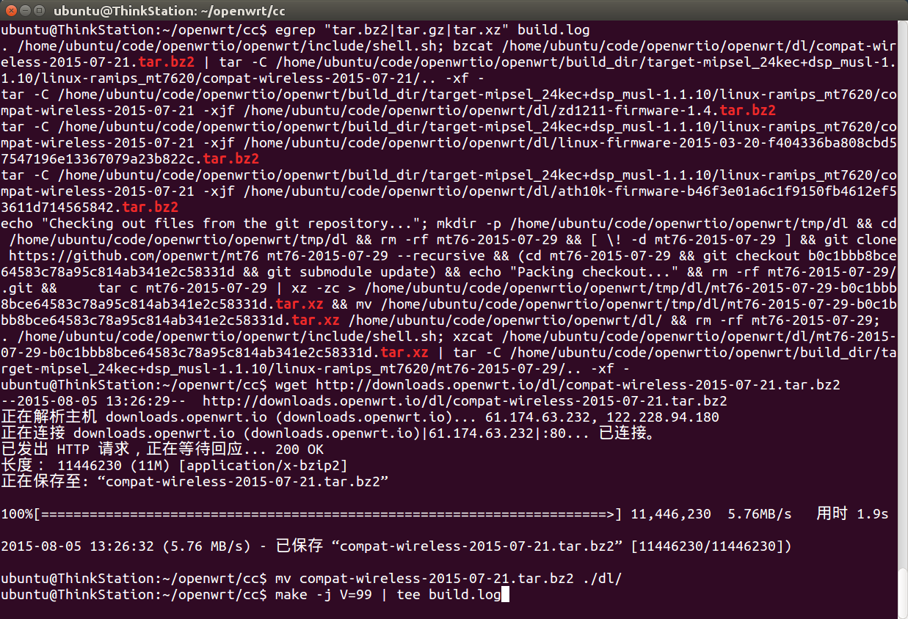
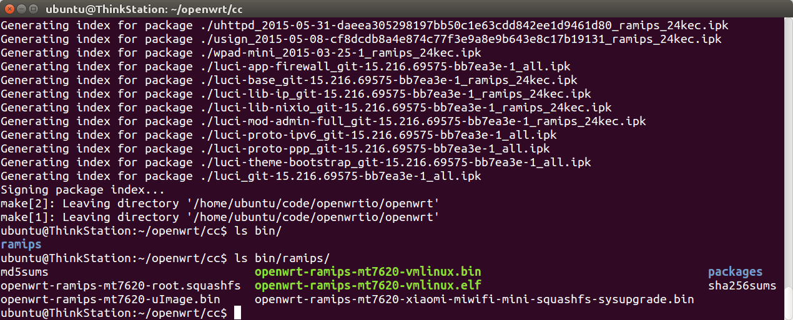
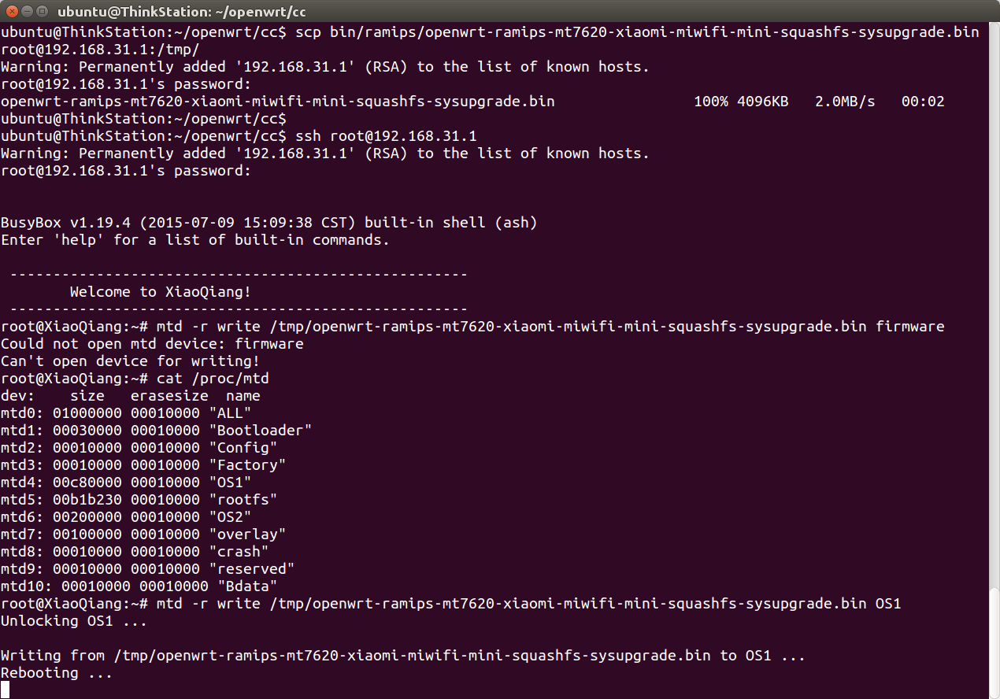
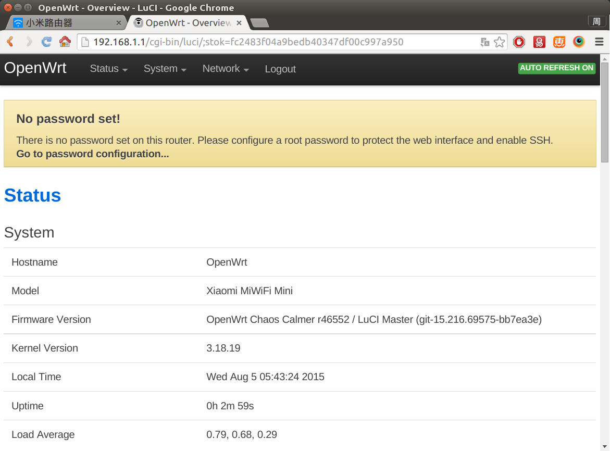
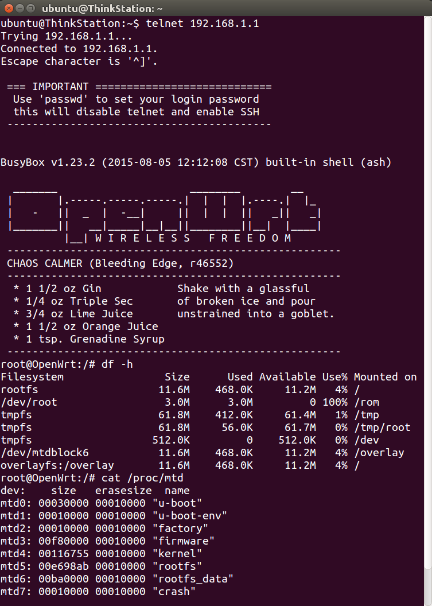

# 编译固件 Build OpenWrt Firmware

如果从网上下载的固件不能满足需求，那就需要自己编译了。

OpenWrt系统已经发布了多个版本，如下：

发布时间 | 版本号 | 开发代号
---------|--------|---------
2013年4月 | 12.09 正式版 | Attitude Adjustment
2014年10月 | 14.07 正式版 | Barrier Breaker
2015年9月 | 15.05 正式版 | Chaos Calmer

这些版本号很长，打字费劲，黑话称之为AA、BB、CC，简洁多了。

新的硬件软件都会加入到最新版本中，而以前的稳定版本只是维护修bug，所以爱好者一般编译最新版。本文以编译CC为例进行讲解。

## 下载最新代码

首先把系统代码下载下来，官方代码在[https://dev.openwrt.org/wiki/GetSource](https://dev.openwrt.org/wiki/GetSource)，如果下载很慢，可以使用国内镜像项目，在[https://coding.net/u/openwrtio/p/openwrt/git](https://coding.net/u/openwrtio/p/openwrt/git)。如果以前下载过，记得时常更新。指令如下：

```
cd ~/openwrt/
git clone -b master git://git.coding.net/openwrtio/openwrt.git cc
cd cc
git pull origin master
```

## 查看是否支持手中的路由器

打开配置界面，按照图中进行选择，国内常见的智能路由器都是联发科MT7620芯片的，所以Target System选Ralink RT288x/RT3xxx，Subtarget选MT7620 based boards，然后进入Target Profile，可以看到小米路由器mini已经加入到开源系统中，所以本文已它为例，没有的童鞋可在京东购买（[￥129](http://union.click.jd.com/jdc?e=&p=AyIBZRprFDJWWA1FBCVbV0IUEEULWldTCQQAQB1AWQkFWxYEGgdTG0RMR05aZXgPD0pOBRx5OXZwFkFUQ1xRaVQDNWtXGTIQBlYaXxQLEQ5lG1sUAhY3ZXopJTI%3D&t=W1dCFBBFC1pXUwkEAEAdQFkJBVsWBBoHUxtETEdOWg%3D%3D)）。

```
make menuconfig
```




## 更新可选的软件源（Feeds）

系统必须的软件是和系统代码集成在一起的，在`package`目录里，而其他可选的软件在各个订阅源里（地址在`feeds.conf.default`里），一般会需要一些，所以进行下载更新，指令如下：

```
./scripts/feeds update -a
./scripts/feeds install -a
```



可以看到，`feeds`目录中出现了很多文件，`package/feeds`里出现了很多软链接指向`feeds`。

## 软件配置

然后再打开配置界面，选择需要的软件（*是集成到固件里，M是编译成ipk手动安装），然后退出保存。建议取消dnsmasq，集成dnsmasq-full。常用的软件有：

位置 | 用途
-----|-----
Base system > dnsmasq-full > Build with IPset support. | dnsmasq的IPset
LuCI > 1. Collections > luci | 路由器网页管理后台

```
make menuconfig
```




## 编译

使用-j参数开启多核编译，速度会更快。指令如下：

```
make -j V=99 | tee build.log
```

然后等待即可。快则几十分钟，慢则几个小时，视CPU性能而定。如果出现文件下载太慢或下载失败，则取消编译，使用下列命令，找出正在下载的文件名，然后到本站的国内镜像下载：[http://downloads.openwrt.io/sources/](http://downloads.openwrt.io/sources/)，放到`dl`目录中，然后重新编译。

```
egrep "tar.bz2|tar.gz|tar.xz" build.log
```



编译成功后，会在`bin`目录中生成固件，比如小米路由mini的固件是`openwrt-ramips-mt7620-xiaomi-miwifi-mini-squashfs-sysupgrade.bin`。



## 刷机

小米路由开放root，按照文档开启（[http://miwifi.com/miwifi_open.html](miwifi-install-openwrt-firmware.png)），然后把固件scp进去，刷机。指令如下：

```
scp bin/ramips/openwrt-ramips-mt7620-xiaomi-miwifi-mini-squashfs-sysupgrade.bin root@192.168.31.1:/tmp/
ssh root@192.168.31.1
cat /proc/mtd
mtd -r write /tmp/openwrt-ramips-mt7620-xiaomi-miwifi-mini-squashfs-sysupgrade.bin OS1
```



PS：如果写入firmware报错“Could not open mtd device: firmware”和“Can't open device for writing!”，使用`cat /proc/mtd`查看闪存，改成写入OS1即可。

刷机完成后，就能看到熟悉的OpenWrt路由器界面了，可以看到根目录有11M可写，可以安装各种ipk软件，可玩性大大增加。




<!-- 多说评论框 start -->
<div class="ds-thread" data-thread-key="docs-build-firmware" data-title="编译OpenWrt固件" data-url="http://openwrt.io/docs/build-firmware/"></div>
<!-- 多说评论框 end -->
