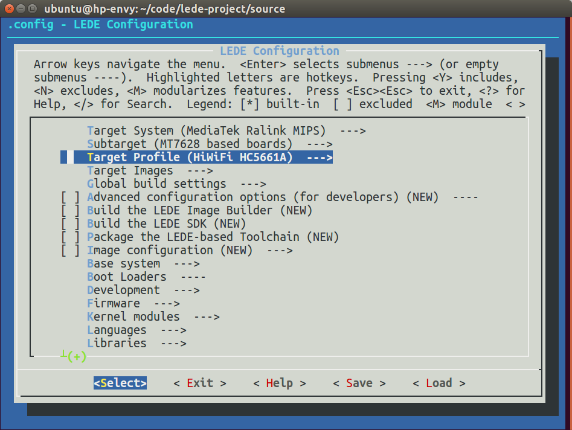

# 编译固件 Build OpenWrt Firmware

如果从网上下载的固件不能满足需求，那就需要自己编译了。

OpenWrt系统已经发布了多个版本，如下：

发布时间 | 版本号 | 开发代号
---------|--------|---------
2016年3月 | 15.05.1 正式版 | Chaos Calmer
2015年9月 | 15.05 正式版 | Chaos Calmer
2014年10月 | 14.07 正式版 | Barrier Breaker
2013年4月 | 12.09 正式版 | Attitude Adjustment

这些版本号很长，打字费劲，黑话称之为AA、BB、CC。

OpenWrt系统是开源的，任何人都可以修改，所以有一群爱好者基于OpenWrt做了[LEDE系统](https://lede-project.org/zh/start)，支持的硬件更多，所以两个项目都要看一下，看看哪个支持你的路由器。

新的硬件软件都会加入到最新版本中，而以前的稳定版本只是维护修bug，所以爱好者一般编译最新版。

## 下载最新代码

首先把系统代码下载下来，OpenWrt官方代码在[https://github.com/openwrt/openwrt](https://github.com/openwrt/openwrt)，如果下载很慢，可以试试国内镜像：[https://coding.net/u/openwrtio/p/openwrt/git](https://coding.net/u/openwrtio/p/openwrt/git)。如果以前下载过，记得时常更新。指令如下：

```
cd ~/openwrt/
mkdir -p dl
git clone -b chaos_calmer git://git.coding.net/openwrtio/openwrt.git chaos_calmer
cd chaos_calmer
git pull origin chaos_calmer
ln -s ../dl ./
```

LEDE官方代码在[https://github.com/lede-project/source](https://github.com/lede-project/source)，命令如下：

```
cd ~/openwrt/
mkdir -p dl
git clone -b master git@github.com:lede-project/source.git lede_master
cd lede_master
git pull origin master
ln -s ../dl ./
```

## 查看是否支持手中的路由器

打开配置界面，按照图中进行选择，可以看到小米路由器mini已经加入了OpenWrt开源系统，而极路由（1s、2、3、4）已加入LEDE。

提示：可以按斜杠/，然后搜品牌或型号，就可以看到你的路由器是否支持了（特例：不能搜Asus）。

小米路由器mini(已停产) 是联发科MT7620芯片，所以Target System选Ralink RT288x/RT3xxx，Subtarget选MT7620 based boards，然后进入Target Profile选Xiaomi MiWiFi Mini。

[极路由器1s（京东￥109）](https://union-click.jd.com/jdc?e=0&p=AyIOZRprFQITA1AaWCVGTV8LRGtMR1dGFxBFC1pXUwkEAEAdQFkJBVsVAxYCVBhETEdOWmVsW00HZ3kXbjsTAUBTC0UucWpOdx5dVxlsEQZVHUcUBA4HVQpbFwkWBF4eWCUAEwRUH1ocARs3VRtaFQYiN1Uaa0NsEgZUGloUAxoGUitcHAERBV0aWBAyEgJdE10RARAAVhtcHDIVNwZGC0dYRlEDK2slMg%3D%3D&t=W1dCFFlQCxxKQgFHRE5XDVULR0UVAhMDUBpYCltXWwg%3D) 是联发科MT7628芯片，所以Target System选MediaTek Ralink MIPS，Subtarget选MT7628 based boards，然后进入Target Profile选HiWiFi HC5661A。

```
make menuconfig
```




## 更新可选的软件源（Feeds）

系统必须的软件是和系统代码集成在一起的，在`package`目录里，而其他可选的软件在各个订阅源里（地址在`feeds.conf.default`里），一般会需要一些，所以进行下载更新，指令如下：

```
./scripts/feeds update -a
./scripts/feeds install -a
```


可以看到，`feeds`目录中出现了很多文件，`package/feeds`里出现了很多软链接指向`feeds`。

## 软件配置

然后再打开配置界面，选择需要的软件（\*是集成到固件里，M是编译成ipk手动安装），然后退出保存。建议取消dnsmasq，集成dnsmasq-full。常用的软件有：

位置 | 用途
-----|-----
Base system > dnsmasq-full > Build with IPset support. | dnsmasq的IPset
LuCI > 1. Collections > luci | 路由器网页管理后台

```
make menuconfig
```


## 编译

使用-j参数开启多核编译，速度会加快。指令如下：

```
make tools/compile -j V=4
make toolchain/compile V=s
make world -j V=4
make -j V=4 | tee build.log
```

如果报错：

> openwrt/staging_dir/toolchain-mipsel_24kec+dsp_gcc-4.8-linaro_uClibc-0.9.33.2/stamp/.toolchain_install] Error 2

可能是因为文件下载失败，需要替换掉无效链接。指令如下：

```
sed -i '/push @mirrors, "ftp:\/\/ftp.all.kernel.org\//d' scripts/download.pl
sed -i 's/http:\/\/ftp.all.kernel.org\/pub\//https:\/\/www.kernel.org\/pub\//g' scripts/download.pl
```

如果文件下载太慢或下载失败，则取消编译，使用本站的CDN加速（[http://downloads.openwrt.io/sources/](http://downloads.openwrt.io/sources/)），然后重新编译。

```
rm dl/*.dl
rm dl/*.md5sum
sed -i 's/http:\/\/mirror1.openwrt.org/http:\/\/downloads.openwrt.io/g' scripts/download.pl
sed -i 's/http:\/\/mirror2.openwrt.org\//http:\/\/downloads.openwrt.io\//g' scripts/download.pl
```

然后等待即可。快则几十分钟，慢则几个小时，视CPU性能而定。编译成功后，会在`bin`目录中生成固件，比如小米路由mini的固件是`openwrt-ramips-mt7620-xiaomi-miwifi-mini-squashfs-sysupgrade.bin`。


## 刷机

小米路由开放root，按照文档开启（[http://miwifi.com/miwifi_open.html](miwifi-install-openwrt-firmware.png)），然后把固件scp进去，刷机。指令如下：

```
scp bin/ramips/openwrt-ramips-mt7620-xiaomi-miwifi-mini-squashfs-sysupgrade.bin root@192.168.31.1:/tmp/
ssh root@192.168.31.1
cat /proc/mtd
mtd -r write /tmp/openwrt-ramips-mt7620-xiaomi-miwifi-mini-squashfs-sysupgrade.bin OS1
```


PS：如果写入firmware报错“Could not open mtd device: firmware”和“Can't open device for writing!”，使用`cat /proc/mtd`查看闪存，改成写入OS1即可。

极路由刷LEDE命令如下：

```
scp bin/targets/ramips/mt7628/lede-ramips-mt7628-hc5661a-squashfs-sysupgrade.bin root@192.168.199.1:/tmp/
ssh root@192.168.199.1
mtd write /tmp/lede-ramips-mt7628-hc5661a-squashfs-sysupgrade.bin firmware
reboot
```

刷机重启后，就能看到熟悉的OpenWrt路由器界面了，可以看到根目录有11M可写，可以安装各种ipk软件，可玩性大大增加。


<div id="comments" data-thread-key="docs-build-firmware"></div>
