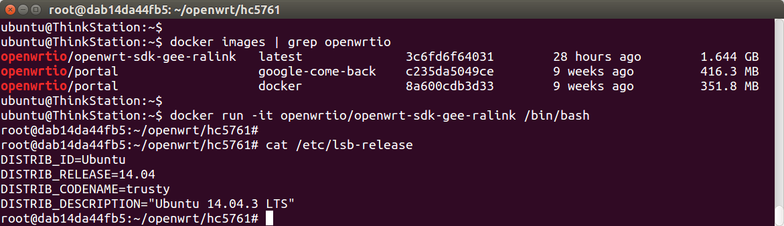
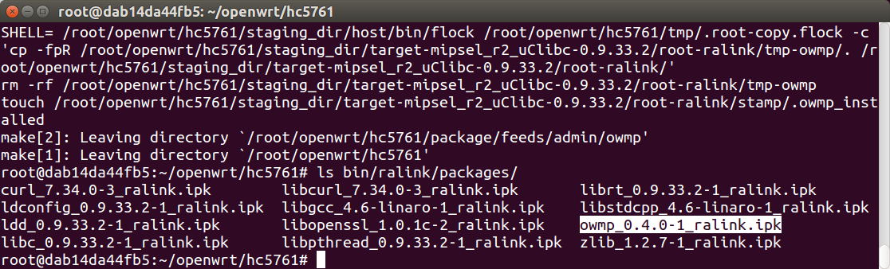

# 使用Docker编译OpenWrt Package

使用Ubuntu编译openwrt时，需要安装很多依赖，然后下载SDK进行配置，每个开发者都需要重复进行这些 步骤。如果做成一个虚拟机镜像，大家下载就能用，就方便多了。使用Docker即可实现。

## 下载 docker image

先安装docker，把当前用户加入docker组。如果用户名是ubuntu，则在Ubuntu系统里指令如下：

```
curl -sSL https://get.daocloud.io/docker | sh
sudo usermod -aG docker ubuntu
```

注销重登录或重启电脑，然后即可下载镜像，但速度会很慢，建议开启daocloud提供的国内mirror加速。步骤：注册[daocloud.io](https://account.daocloud.io/signup?invite_code=c8bkkhc1uq8i7z8nin93)，然后打开管理后台——加速器。指令如下：

```
echo "DOCKER_OPTS=\"\$DOCKER_OPTS --registry-mirror=http://ec2b1153.m.daocloud.io\"" | sudo tee -a /etc/default/docker
sudo service docker restart
```

然后即可高速下载了，本文以极路由ralink架构为例，下载指令如下：

```
docker pull openwrtio/openwrt-sdk-gee-ralink
```

## 启动 docker image

```
docker run -it openwrtio/openwrt-sdk-gee-ralink /bin/bash
```



可以看到此docker镜像是Ubuntu 14.04系统，openwrt的编译环境都配好了，直接编译package即可。

## 编译 openwrt package

在docker镜像中执行下列指令即可：

```
git clone -b for-gee-ralink git://git.coding.net/openwrtio/packages.git package/feeds
echo 'CONFIG_PACKAGE_owmp=m' >> .config
make defconfig
make package/feeds/admin/owmp/compile -j V=99
```



编译成功。然后如何发布到opkg软件仓库中？请自行思考。

## 本站提供的 openwrt docker

所有镜像：[https://hub.docker.com/u/openwrtio/](https://hub.docker.com/u/openwrtio/)

用途 | 下载命令
-----|-----
极路由ralink | docker pull openwrtio/openwrt-sdk-gee-ralink
极路由mediatek | docker pull openwrtio/openwrt-sdk-gee-mediatek

<!-- 多说评论框 start -->
<div class="ds-thread" data-thread-key="docs-build-openwrt-package-using-docker" data-title="使用Docker编译OpenWrt package" data-url="http://openwrt.io/docs/build-openwrt-package-using-docker/"></div>
<!-- 多说评论框 end -->
