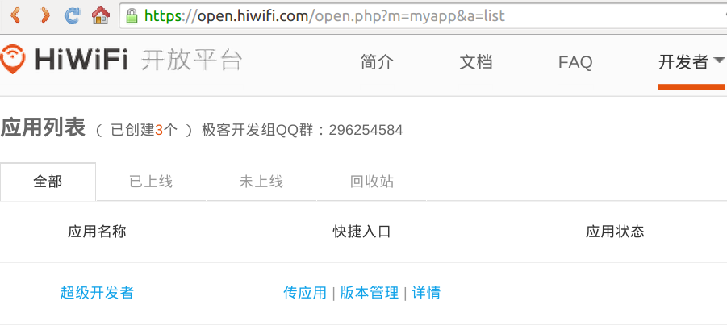
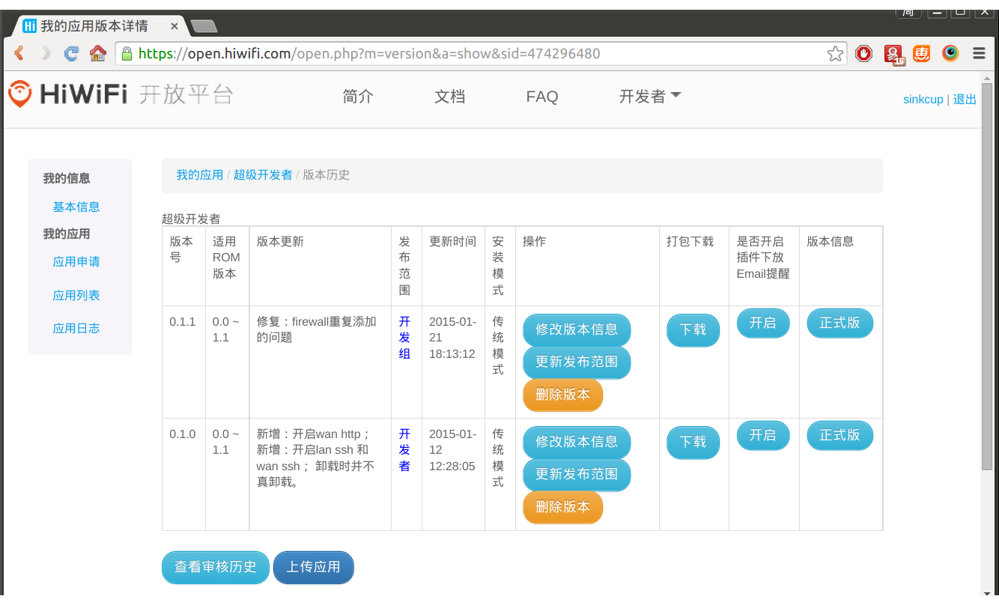
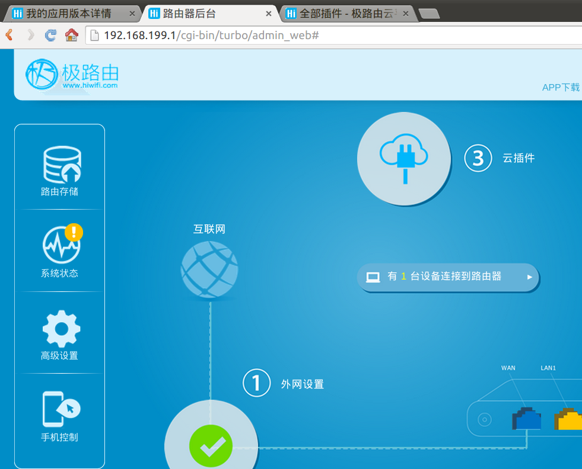
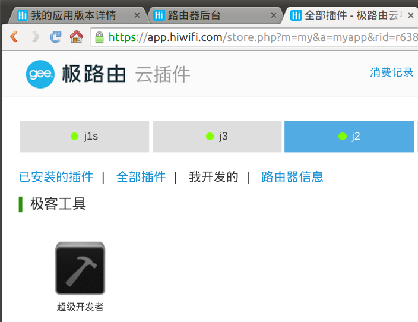
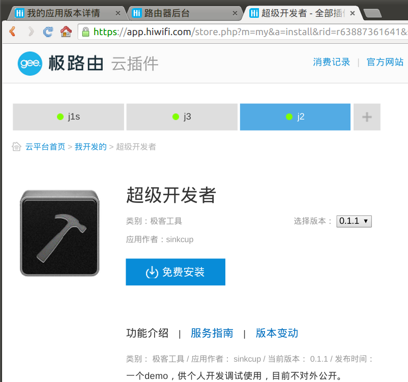
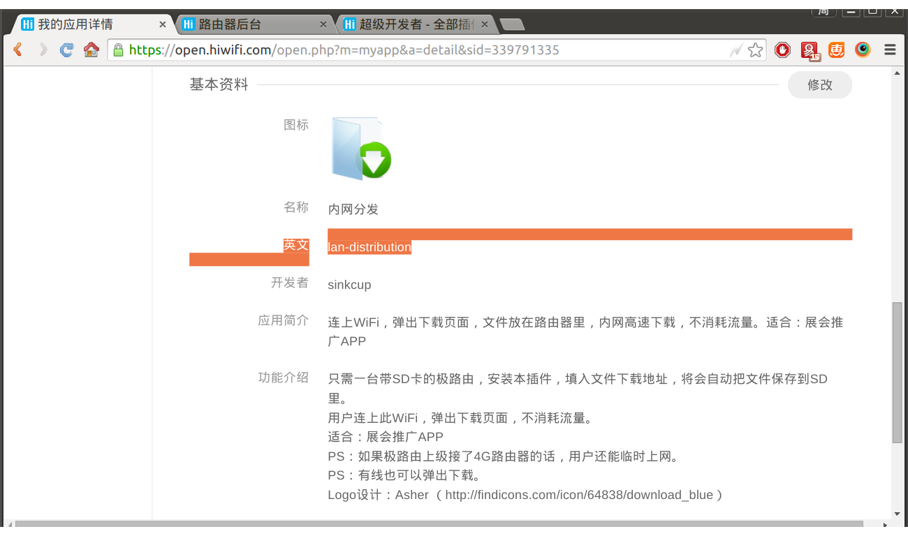
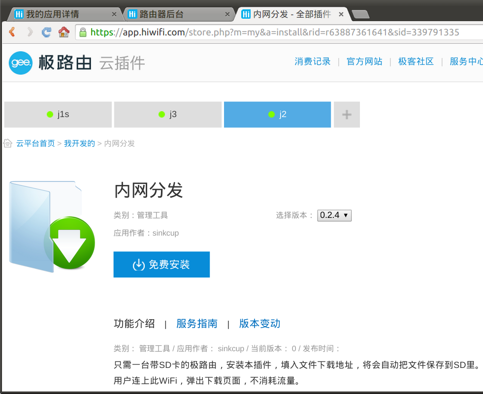
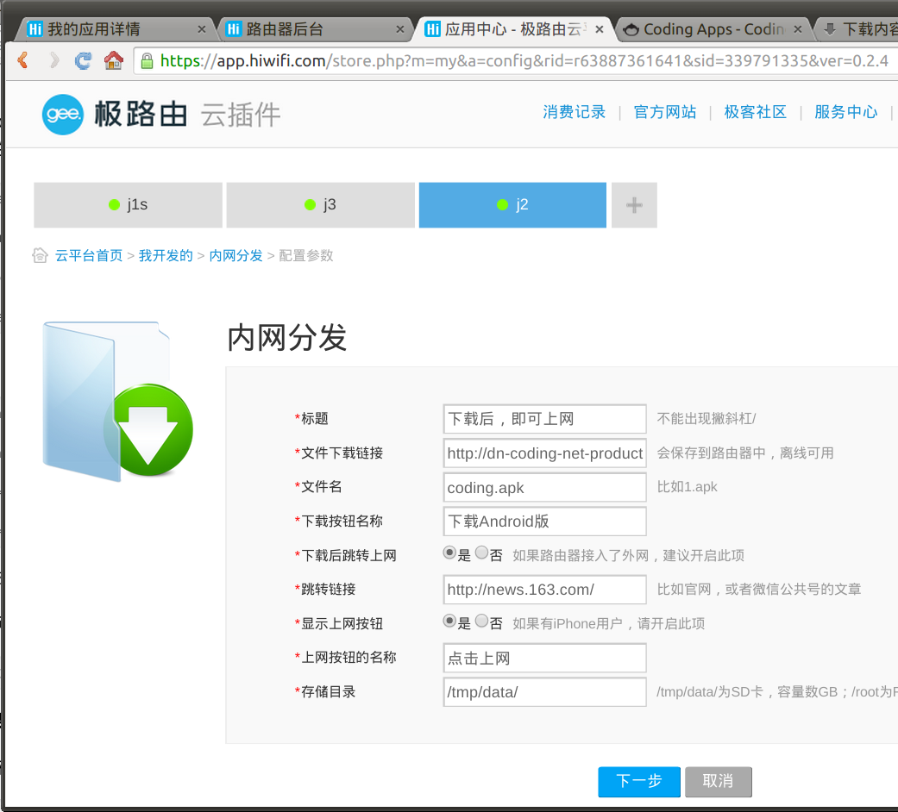

# 开发极路由云插件

学会了编译ipk，也学会了opkg安装软件之后，下面讲解如何开发极路由应用（又称为APP或插件）。

## 最简单的应用

一个最简单的极路由应用只需要一个`script`脚本文件，比如这个“超级开发者”项目（[https://coding.net/u/openwrtio/p/super-developer-for-hiwifi-os/git/tree/master](https://coding.net/u/openwrtio/p/super-developer-for-hiwifi-os/git/tree/master)），代码如下：

```
#!/bin/sh

install() {
    opkg update
    opkg install dropbear
    /etc/init.d/dropbear enable

    start

    return $?
}

uninstall() {
    stop
    /etc/init.d/dropbear disable
    opkg remove dropbear

    return $?
}

start() {
    /etc/init.d/dropbear start >/dev/null 2>&1
    return $?
}

stop() {
    /etc/init.d/dropbear stop >/dev/null 2>&1
    return $?
}

# 检查运行状态
status() {
    local stat="running"

    pgrep dropbear >/dev/null 2>&1

    if [ $? -ne 0 ];then
        stat="stopped"
    fi

    echo "{ \"status\" : \"$stat\" }"
    return $?
}
```

可以看到脚本语法是`/bin/sh`，包含了安装、卸载、启动、停止这几个函数，非常简单，学习一下sh语法即可。

## 发布到插件市场

把脚本拷贝到路由器中，可以手动安装，进行开发调试。

```
git clone git://git.coding.net/openwrtio/super-developer-for-hiwifi-os.git
cd super-developer-for-hiwifi-os
tar -zcvf tmp.tgz ./*
scp tmp.tgz root@192.168.199.1:/tmp/
ssh root@192.168.199.1
cd /tmp/
tar -zxvf tmp.tgz
(. ./script; install)
```

如果开发测试完成，如何提供给大家方便的安装？极路由做了插件市场，注册一个开发者帐号（[https://open.hiwifi.com/](https://open.hiwifi.com/)），申请一个应用，把插件打包上传，即可在插件市场里安装（[https://app.hiwifi.com/](https://app.hiwifi.com/)）。可通过“路由器后台”——》“云插件”进入市场，尚未发布时，在“我开发的”页面里安装。如果提交审核上线，用户就能看到了。







## 带网页配置界面的插件

上面的插件实现了打开root ssh，端口默认是22，没有让用户输入。如果用户想安装时指定端口，以后随时可以修改端口，怎么办？那就需要网页配置界面了。

请看这个项目：内网分发（[https://coding.net/u/openwrtio/p/lan-distribution-for-gee/git](https://coding.net/u/openwrtio/p/lan-distribution-for-gee/git)），在极路由开放平台申请了应用，英文名为lan-distribution，做网页配置界面需要增加两个文件：`manifest.json`和以插件英文名命名的配置文件，比如`lan-distribution.conf`。



`manifest.json`定义网页界面，代码节选如下：

```
{
    "manifest_version": "2.0.0",
    "configuration": [
        {
            "name": "文件下载链接",
            "type": "text",
            "variable": "fileuri",
            "defaultvalue": "",
            "required": 1,
            "description": "会保存到路由器中，离线可用。由于路由器不支持https，请填入http"
        },
        {
            "name": "下载后跳转上网",
            "type": "radio",
            "variable": "redirectafterdownload",
            "choices": "是=1;否=0",
            "defaultvalue": "1",
            "required": 1,
            "description": "如果路由器接入了外网，建议开启此项"
        }
    ]
}
```

极路由插件的网页配置支持这几种数据类型：text、textfile、radio、selection、checkbox，分别表示单行文本、多行文本、单选框、下拉菜单、多选框，具体说明请看官方文档：[https://open.hiwifi.com/open.php?m=doc&a=index#dev\_wiki](https://open.hiwifi.com/open.php?m=doc&a=index#dev_wiki)。

每段输入都有个"variable"字段，在网页中输入的内容会被赋值给这些变量（**注意：极路由variable变量不能使用下划线**）。`script`脚本执行install时如何获取这些值？那就需要app配置文件了，比如这个app的是`lan-distribution.conf`，代码如下：

```
file_uri={$fileuri}
redirect_after_download={$redirectafterdownload}
```

网页安装时，右边的变量会被自动替换。然后在`script`脚本中导入即可，代码如下：

```
#!/bin/sh
install() {
    # web安装界面的参数会保存到文件，这里引用参数文件，即可使用变量
    . ./lan-distribution.conf
    
    wget -O /tmp/data/test "$file_uri"
    if [ $? -ne 0 ]; then
        echo "<User-Echo>下载失败"
        exit 1
    fi
}
```

打包，上传到极路由插件市场，安装，界面如下图：




## 自定义opkg软件仓库的插件

在刚才的`script`文件中，还会看到这些代码：

```
install() {
    set_opkg_src
    opkg update

    opkg install nodogsplash
}

get_arch() {
    opkg print-architecture | grep "ralink" >/dev/null
    if [ $? -eq 0 ]; then
        echo "ralink"
        return 0
    fi
    opkg print-architecture | grep "ar71xx" >/dev/null
    if [ $? -eq 0 ]; then
        echo "ar71xx"
        return 0
    fi
    echo "<User-Echo>get arch失败"
    exit 1
}

set_opkg_src() {
    echo "set_opkg_src start"
    arch=`get_arch`
    tmp=$(grep 'src/gz openwrtio ' /etc/opkg.conf)
    if [ $? -eq 0 ]; then
        return 0
    fi
    openwrtio_src='http://dl.openwrt.io/vendors/gee/'$arch'/packages'
    #gee use /etc/opkg.conf and /etc/opkg.d/*.conf
    echo 'src/gz openwrtio '$openwrtio_src >> /etc/opkg.conf
    for one_file in $(find /etc/opkg.d/ -iname '*.conf'); do
        echo 'src/gz openwrtio '$openwrtio_src >> $one_file
    done
    echo "set_opkg_src end"
    return 0
}
```

可以看出这段代码添加了opkg软件仓库，然后安装了nodogsplash这个软件，这是因为极路由官方仓库里没有这个软件（也没有地方给大家提交软件），开发者就需要从别的地方安装。极路由有多个架构（ar71xx、ralink和mediatek），所以代码里先判断架构，然后添加不同的源（源列表在以前的文档里：[《opkg软件源》](/docs/opkg/#gee-ralink-opkg-j1s-j2-j3)）。

可以看出极路由云插件是对opkg的再封装，提供了一个远程网页安装和配置界面，很方便。是一大创新，和luci本地网页界面的需求不同。

## 练习题

尝试为“超级开发者”做一个网页配置界面，实现修改端口的功能。

<div id="comments" data-thread-key="docs-create-gee-app"></div>
