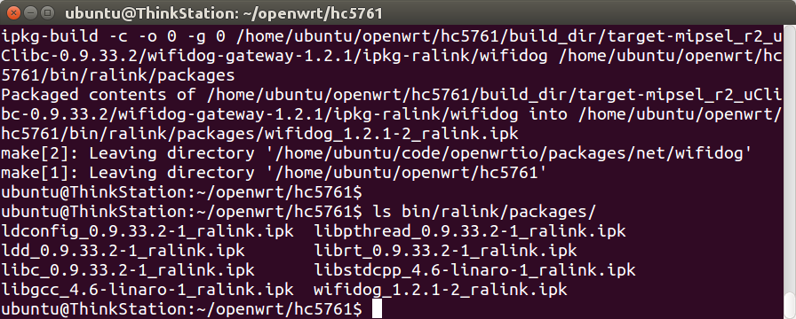
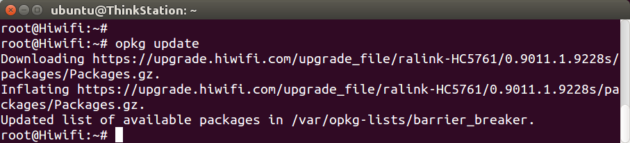
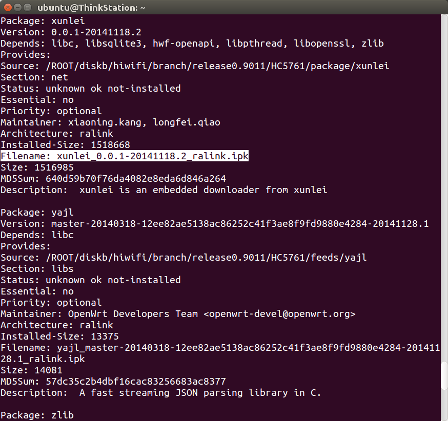
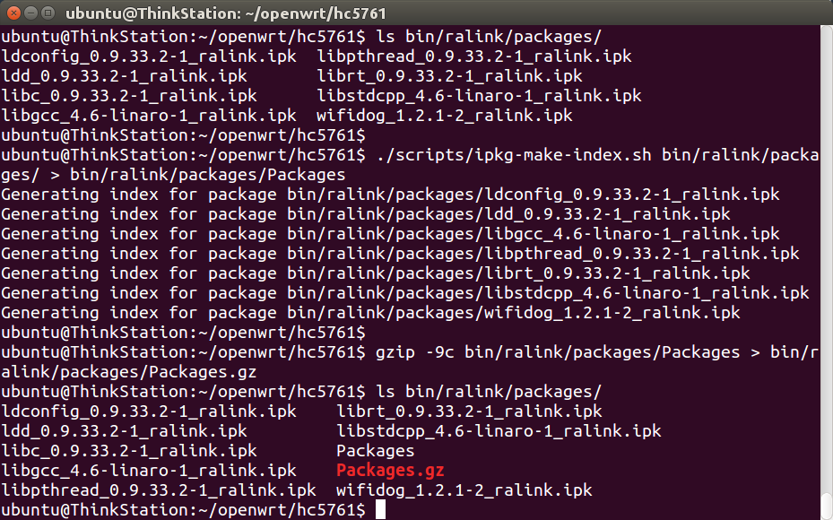
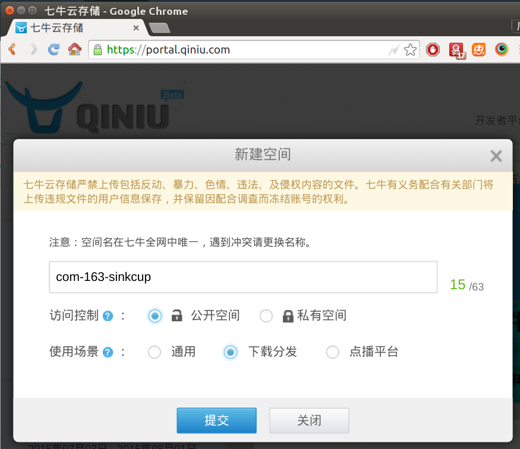
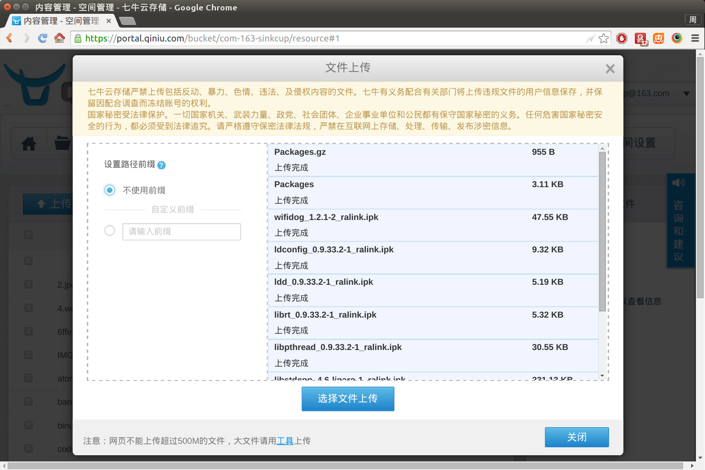
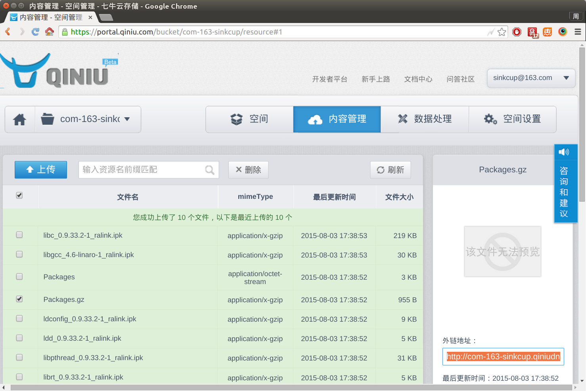
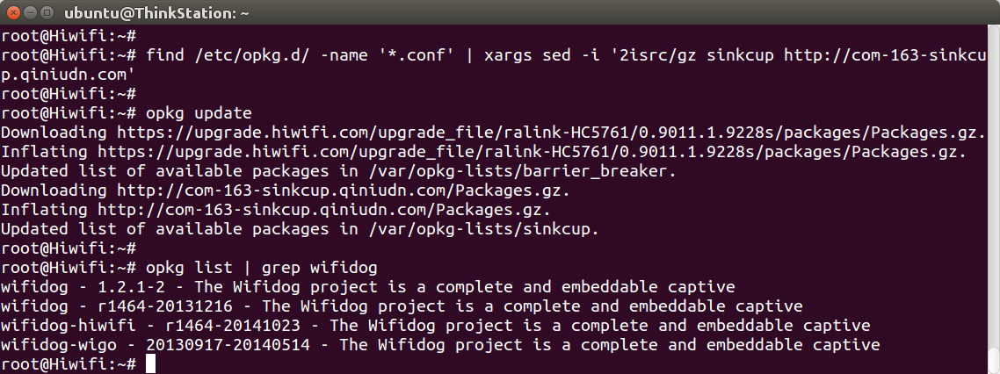

极路由和优酷都提供了官方opkg软件仓库（package repository），但开发者无法提交新软件进去，一旦需要用的软件不在里面，怎么办？有两个办法：添加到开源仓库 或者 搭建自己的仓库。

## 添加到开源软件仓库

极路由、优酷、小米、魔豆使用的都是OpenWrt 12.09老系统，而OpenWrt.org官方已不再维护12.09和对应的仓库了，所以本站发起了一个开源项目——12.09软件仓库，代码在：[https://coding.net/u/openwrtio/p/packages/git](https://coding.net/u/openwrtio/p/packages/git)。

如果你需要某个软件，而此仓库中没有，欢迎fork项目，然后发起PR（合并请求）。

## 搭建自己的opkg软件仓库

按照之前的文档（[http://openwrt.io/docs/build-a-single-package/](http://openwrt.io/docs/build-a-single-package/)），编译了package，然后查看`bin`目录，会看到里面都是ipk文件，如图：



而在路由器中执行`opkg update`时，下载的是仓库里的`Packages.gz`文件，手动下载解压，会发现里面是ipk索引，安装时就是按照`Filename`字段下载了具体的ipk。



```
wget https://upgrade.hiwifi.com/upgrade_file/ralink-HC5761/0.9011.1.9228s/packages/Packages.gz
gzip -d Packages.gz
cat Package
```



### 生成索引文件Packages.gz

按照上面的原理，如果我们生成`Packages.gz`，把它和编译出来的ipk都上传到网上即可实现自己的仓库。生成`Packages.gz`的指令如下：

```
cd ~/openwrt/hc5761/
./scripts/ipkg-make-index.sh bin/ralink/packages/ > bin/ralink/packages/Packages
gzip -9c bin/ralink/packages/Packages > bin/ralink/packages/Packages.gz
```



### 上传到七牛云储存

然后上传到哪里？建议放在云储存CDN上，下载速度快，而不要放在自己服务器上。本文以七牛云储存（每月免费10GB流量，官网[qiniu.com](https://portal.qiniu.com/signup?code=3lafkpsz7yes1)）为例，新建一个空间，上传文件，如图：





点击每个文件，右边都会出现外链地址，比如：

```
http://com-163-sinkcup.qiniudn.com/Packages.gz
```

那对应的opkg设置为：

```
src/gz sinkcup http://com-163-sinkcup.qiniudn.com
```

把自己的源加入极路由opkg配置中，然后就能看到新版的wifidog了，如图：



<!-- 多说评论框 start -->
<div class="ds-thread" data-thread-key="docs-create-opkg-package-repository" data-title="搭建自己的opkg软件仓库" data-url="http://openwrt.io/docs/create-opkg-package-repository/"></div>
<!-- 多说评论框 end -->
