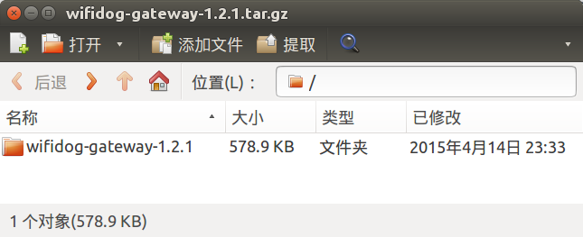

# 开发package软件包

在开发智能路由器的过程中，如果有一个新需求，那先去google一下，到openwrt官方仓库里找一找package，如果没有的话，再自己开发一个。避免重新发明轮子。

比如商业wifi（广告wifi）需要的上网欢迎页，已经有nodogsplash实现了；上网欢迎页加上认证计费，有wifidog实现了。

远程云管理方面，有autossh实现了实时ssh管理（可少量调试使用，服务器负载高，无法承受数百台路由器）；有TR-069 cwmp协议的软件（比如easycwmp、freecwmp）实现了定时管理（但用的是XML格式，已淘汰，配套开发维护服务端的成本较高）。

## 目录结构

如果确定市面上的软件无法满足需求，需要自己开发的话，也很简单。在`package`目录中有很多软件，看一看，会发现包格式如下：

文件 | 是否必须 | 用途
-----|----------|-----
package/Makefile | 是 | 定义了软件名称、版本、编译、安装等指令
package/files/ | 否 | 启动脚本、配置文件等
package/patches/ | 否 | 代码的补丁

以wifidog为例（package在[https://coding.net/u/openwrtio/p/packages/git/tree/for-12.09/net/wifidog](https://coding.net/u/openwrtio/p/packages/git/tree/for-12.09/net/wifidog)），`Makefile`内容如下：

```
include $(TOPDIR)/rules.mk

PKG_NAME:=wifidog
PKG_VERSION:=1.2.1
PKG_RELEASE=2

PKG_LICENSE:=GPL-2.0
PKG_MAINTAINER:=sinkcup <sinkcup@163.com>

PKG_SOURCE_VERSION=$(PKG_VERSION)
PKG_SOURCE:=$(PKG_NAME)-gateway-$(PKG_SOURCE_VERSION).tar.gz
PKG_SOURCE_URL:=http://downloads.openwrt.io/sources/ \
    https://github.com/wifidog/wifidog-gateway/releases/download/$(PKG_SOURCE_VERSION)/
PKG_MD5SUM:=3c9c35968f154b1c9224245a5d708d5f
PKG_BUILD_DIR:=$(BUILD_DIR)/$(PKG_NAME)-gateway-$(PKG_SOURCE_VERSION)

PKG_FIXUP:=autoreconf
PKG_INSTALL:=0

include $(INCLUDE_DIR)/package.mk

define Package/wifidog
  SUBMENU:=Captive Portals
  SECTION:=net
  CATEGORY:=Network
  DEPENDS:=+iptables-mod-extra +iptables-mod-ipopt +kmod-ipt-nat +iptables-mod-nat-extra +libpthread
  TITLE:=A wireless captive portal solution
  URL:=http://www.wifidog.org
endef

define Package/wifidog/description
	The Wifidog project is a complete and embeddable captive
	portal solution for wireless community groups or individuals
	who wish to open a free Hotspot while still preventing abuse
	of their Internet connection.
endef

define Package/wifidog/conffiles
/etc/wifidog.conf
endef

define Package/wifidog/install
	$(INSTALL_DIR) $(1)/usr/bin
	$(INSTALL_BIN) $(PKG_BUILD_DIR)/scripts/init.d/wifidog $(1)/usr/bin/wifidog-init
	$(INSTALL_BIN) $(PKG_INSTALL_DIR)/usr/bin/wifidog $(1)/usr/bin/
	$(INSTALL_BIN) $(PKG_INSTALL_DIR)/usr/bin/wdctl $(1)/usr/bin/
	$(INSTALL_DIR) $(1)/usr/lib
	$(CP) $(PKG_INSTALL_DIR)/usr/lib/libhttpd.so* $(1)/usr/lib/
	$(INSTALL_DIR) $(1)/etc
	$(INSTALL_DATA) $(PKG_BUILD_DIR)/wifidog.conf $(1)/etc/
	$(INSTALL_DATA) $(PKG_BUILD_DIR)/wifidog-msg.html $(1)/etc/
	$(INSTALL_DIR) $(1)/etc/init.d
	$(INSTALL_BIN) ./files/wifidog.init $(1)/etc/init.d/wifidog
endef

$(eval $(call BuildPackage,wifidog))
```

## 软件包变量

变量名 | 是否必须 | 用途
-------|----------|-----
PKG_VERSION | 是 | 包版本，一般与代码版本一致，建议使用[语义化版本号](http://semver.org/lang/zh-CN/)
PKG_RELEASE | 是 | 第几次打包。比如版本没变，第一次打包，PKG_RELEASE为1，发布了`wifidog_1.2.1-1_ralink.ipk`，然后发现配置文件不佳，进行第二次打包，PKG_RELEASE需改为2，会生成`wifidog_1.2.1-2_ralink.ipk`。
PKG_SOURCE_VERSION | 否 | 代码版本，比如使用git的tag，建议使用语义化版本号。无压缩包，而从git clone时，使用commit id。
PKG_SOURCE | 是 | 代码文件名，下载完毕会保存到`dl`目录。
PKG_SOURCE_URL | 是 | 代码下载链接的目录（下载时会自动加上PKG_SOURCE文件名），支持多个镜像，每行一个
PKG_BUILD_DIR | 是 | 编译软件包的目录

可以看到wifidog的代码文件名是`wifidog-gateway-1.2.1.tar.gz`，下载路径有2个：

 * http://downloads.openwrt.io/sources/
 * https://github.com/wifidog/wifidog-gateway/releases/download/1.2.1/

拼成完整的下载链接就是：

 * [http://downloads.openwrt.io/sources/wifidog-gateway-1.2.1.tar.gz](http://downloads.openwrt.io/sources/wifidog-gateway-1.2.1.tar.gz)
 * [https://github.com/wifidog/wifidog-gateway/releases/download/1.2.1/wifidog-gateway-1.2.1.tar.gz](https://github.com/wifidog/wifidog-gateway/releases/download/1.2.1/wifidog-gateway-1.2.1.tar.gz)

下载之后，解压缩，会发现子目录是`wifidog-gateway-1.2.1`，如图：



所以PKG_BUILD_DIR要设置正确，才能顺利编译。

## 宏定义

### Package/$(PKG_NAME)

变量名 | 是否必须 | 用途
-------|----------|-----
CATEGORY | 是 | 一级分类
SUBMENU | 否 | 二级分类
DEPENDS | 否 | 依赖。加号“+”表示自动选中此依赖，比较常用。
TITLE | 否 | 简介

### Package/$(PKG_NAME)/conffiles （可选）

配置文件列表。安装时，如果配置文件已存在，则不会被覆盖。卸载时，如果配置文件被修改过，则不会被删除。

### Package/$(PKG_NAME)/install （可选）

安装指令。比如拷贝一些文件。常用的有：INSTALL_DIR、INSTALL_BIN、INSTALL_DATA、CP。

## 业务代码

可以看到package里面只是打包ipk所用的启动脚本、配置文件等，没有业务代码。业务代码在网上，通过PKG_SOURCE_URL指定下载链接，编译时自动下载。因为代码是单独的项目，比如dnsmasq、wifidog，是C、C++、shell等语言开发的，一般都是跨平台的，电脑、手机、路由器都能用，有独立的项目网址，所以不会放在package里。

所以想实现一个需求，首先要做的是开发业务代码。比如wifidog的业务代码在：[https://github.com/wifidog/wifidog-gateway](https://github.com/wifidog/wifidog-gateway)，是开源项目，大家一起写代码，合并进去即可。

如果已有的项目不能满足需求，那就需要自行开发新项目。比如owmp，

* 业务代码在：[https://coding.net/u/openwrtio/p/owmp/git/tree/0.4.0/](https://coding.net/u/openwrtio/p/owmp/git/tree/0.4.0/)，只有一个shell文件和一个`Makefile`。
* package在：[https://coding.net/u/openwrtio/p/packages/git/tree/for-12.09/admin/owmp](https://coding.net/u/openwrtio/p/packages/git/tree/for-12.09/admin/owmp)

## 发布

开发完毕，编译打包生成ipk，发布到opkg软件仓库里即可。请按照之前的文档[《搭建opkg软件仓库》](/docs/create-opkg-package-repository/)进行操作。

<!-- 多说评论框 start -->
<div class="ds-thread" data-thread-key="docs-create-package" data-title="开发package" data-url="http://openwrt.io/docs/create-package/"></div>
<!-- 多说评论框 end -->
