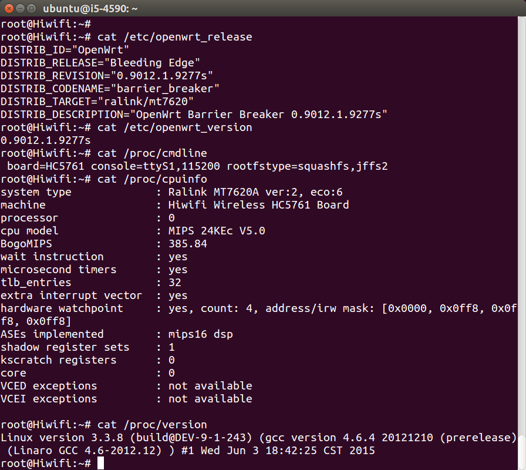
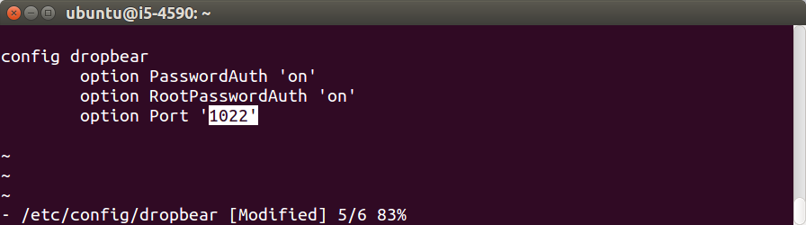

#OpenWrt开发指南

根据上一篇文章的比较，极路由“开放root”而且“根目录可写”，很适合折腾使用和开发，所以本文档以极路由2为例，建议使用极2或极3，以免出现文档执行不通的问题。

## 背景知识

需要掌握：Linux常用命令和软件（apt-get、grep、nslookup、sed、ssh、telnet、vi）、Linux目录结构、网络常识（DHCP、DNS、gateway网关、netmask子网掩码、PPPoE、静态IP、路由器和交换机的区别）。请自行google学习。

## root

按照[极路由官方文档](http://bbs.hiwifi.com/thread-74899-1-1.html)，开通“开发者模式”即root权限和TTL串口。然后就能ssh登录进去了，命令如下：

```
ssh -p 1022 root@192.168.199.1
```


然后可是试试各种Linux命令和程序，比如：

```
pwd
ls /
ifconfig
iptables-save
```

还可以查看系统信息，比如：

```
uname -a
cat /proc/version
df -h
cat /etc/openwrt_release
cat /etc/openwrt_version
cat /proc/cmdline
cat /proc/cpuinfo
```



可以看到这台极路由的Linux内核版本是3.3.8，固件版本是0.9012.1.9277s，型号是HC5761。

## dropbear

dropbear是一个轻量级的ssh server，常用于路由器等单用户设备中。打开`/etc/config/dropbear`，把1022端口修改成22，然后重启dropbear，以后ssh和scp就不用加端口了，就方便多了。指令如下：

```
vi /etc/config/dropbear
/etc/init.d/dropbear restart
exit
ssh root@192.168.199.1
```



路由器、服务器里没有IDE，常用的是vi编辑器，是必备技能，请自行google学习。

##练习

验证各个分区是否可写。在每个分区创建一个文件，重启路由器，检查文件是否丢失。

<!-- 多说评论框 start -->
<div class="ds-thread" data-thread-key="docs-developer-guide" data-title="开发者指南" data-url="http://openwrt.io/docs/developer-guide/"></div>
<!-- 多说评论框 end -->
