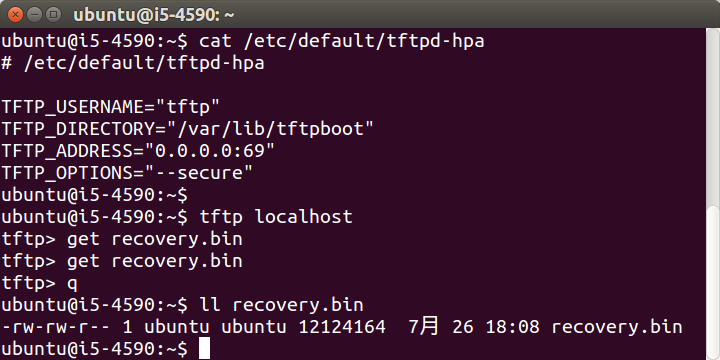
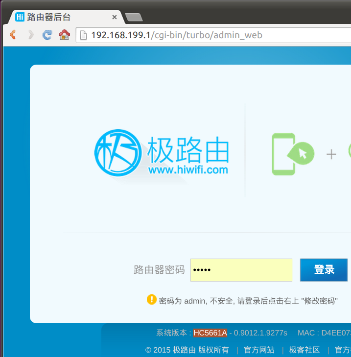
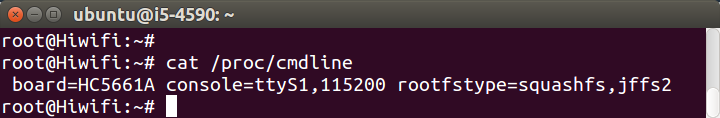
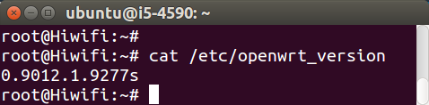
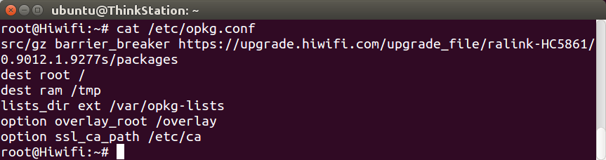

## 极路由固件下载

rom版本        | 极3 HC5861 | 极2新款 HC5761A | 极2老款 HC5761 | 极1s新款 HC5661A
---------------|------------|-----------------|----------------|------------------
0.9017.1.11380s | [下载](http://ur.ikcd.net/HC5861-sysupgrade-20151225-9b846fe9.bin) | [下载](http://ur.ikcd.net/HC5761A-sysupgrade-20151225-3e92b3d9.bin) | [下载](http://ur.ikcd.net/HC5761-sysupgrade-20151225-e8c2c158.bin) | [下载](http://ur.ikcd.net/HC5661A-sysupgrade-20151225-0c14834a.bin)
0.9016.1.10769s | [下载](http://ur.ikcd.net/HC5861-sysupgrade-20151120-1b82b142.bin) | [下载](http://ur.ikcd.net/HC5761A-sysupgrade-20151120-aca7359a.bin) | [下载](http://ur.ikcd.net/HC5761-sysupgrade-20151120-cf095275.bin) | [下载](http://ur.ikcd.net/HC5661A-sysupgrade-20151119-a92157d2.bin)
0.9015.1.10299s | | | [下载](http://ur.ikcd.net/HC5761-sysupgrade-20150928-4c870d01.bin) |
0.9013.1.9653s | [下载](http://ur.ikcd.net/HC5861-sysupgrade-20150801-3c058db6.bin) | | [下载](http://ur.ikcd.net/HC5761-sysupgrade-20150801-805354de.bin) |
0.9012.1.9277s | [下载](http://ur.ikcd.net/HC5861-sysupgrade-20150603-15fa16e2.bin) | | [下载](http://ur.ikcd.net/HC5761-sysupgrade-20150603-3356d35e.bin) | [下载](http://ur.ikcd.net/HC5661A-sysupgrade-20150603-d1929a87.bin)
0.9011.1.9228s | [下载](http://ur.ikcd.net/HC5861-sysupgrade-20150527-5bc6d079.bin) | | [下载](http://ur.ikcd.net/HC5761-sysupgrade-20150527-99cca6fc.bin) | 
0.9011.1.9117s | | | | [下载](http://ur.ikcd.net/HC5661A-sysupgrade-20150518-50bf0edc.bin)
0.9010.1.8595s | [下载](http://ur.ikcd.net/HC5861-sysupgrade-20150318-5db29eb5.bin) | | [下载](http://ur.ikcd.net/HC5761-sysupgrade-20150319-21e48669.bin) | 
0.9004.3685s   | | | [下载](http://ur.ikcd.net/HC5761-sysupgrade-2014060900.bin) | 
更多           | [查看](http://downloads.openwrt.io/vendors/gee/ralink/) | [查看](http://downloads.openwrt.io/vendors/gee/mediatek/) | [查看](http://downloads.openwrt.io/vendors/gee/ralink/) | [查看](http://downloads.openwrt.io/vendors/gee/mediatek/)

已停产型号的固件下载：

 * 极2老款 HC5761、极1s老款 HC5661 ： [http://downloads.openwrt.io/vendors/gee/ralink/](http://downloads.openwrt.io/vendors/gee/ralink/)
 * 极1 HC6361 ： [http://downloads.openwrt.io/vendors/gee/ar71xx/](http://downloads.openwrt.io/vendors/gee/ar71xx/)

极路由官网ROM下载：[http://www.hiwifi.com/rom](http://www.hiwifi.com/rom)

在极路由里执行`tcpdump`，然后在网页后台点升级然后取消，即可抓取极路由rom官方下载链接，然后打开`a.cap`搜索`bin`即可。指令如下：

```
tcpdump -i eth2.2 host ur.ikcd.net -w a.cap
```

## 极路由刷官方原厂固件

当极路由变砖无法正常工作时，可尝试刷机，一般都能修复。极路由支持tftp方式刷机，要求是：电脑装有tftp server，电脑IP需为192.168.1.88，固件名需为`recovery.bin`。

在Ubuntu电脑上先安装tftp，指令如下：

```
sudo apt-get install tftpd-hpa tftp-hpa
```

然后修改配置`/etc/default/tftpd-hpa`，否则第一次下载成功，以后都会失败报错："Transfer timed out."。

```
sudo sed -i 's/^TFTP_ADDRESS.*/TFTP_ADDRESS="0.0.0.0:69"/' /etc/default/tftpd-hpa
```

然后把固件拷进去，指令如下：

```
sudo chmod 777 /var/lib/tftpboot/
cp ~/Downloads/openwrt-ramips-mt7620a-hiwifi-hc5761-squashfs-sysupgrade.bin /var/lib/tftpboot/recovery.bin
chmod a+r /var/lib/tftpboot/recovery.bin
sudo service tftpd-hpa restart
```

需要测试一下能否正常下载，指令如下：

```
cd ~
tftp localhost
tftp> get recovery.bin
tftp> q
ll recovery.bin
```



然后把电脑IP设置为192.168.1.88，如果电脑有双网卡的话，会很方便。如图：


然后按住极路由的RESET键（极3直接按，极2等老机器需要用尖锐物（笔、取卡针、通针等）），给极路由通电。

观察电脑中tftp server的发送情况（可通过网速看出来），传输完毕即可松开RESET键。

路由器面板的多个灯会轮流亮起（跑马灯效果），跑完以后，路由器自动重启，刷机即完成。

## 网页查看极路由设备型号和固件版本

路由器网页后台的页脚，能看到“系统版本：设备型号 - 固件版本”，如图：



## 命令查看极路由设备型号

```
cat /proc/cmdline
```



## 命令查看极路由固件版本

```
cat /etc/openwrt_version
```



## 官方 opkg 配置

极路由官方opkg源地址为`https://upgrade.hiwifi.com/upgrade_file/{arch}-{board}/{rom_version}/packages`，比如极3的`opkg.conf`如下：

```
src/gz barrier_breaker https://upgrade.hiwifi.com/upgrade_file/ralink-HC5861/0.9012.1.9277s/packages
dest root /
dest ram /tmp
lists_dir ext /var/opkg-lists
option overlay_root /overlay
option ssl_ca_path /etc/ca
```



极1s HC5661A的opkg源为：

```
src/gz barrier_breaker https://upgrade.hiwifi.com/upgrade_file/mediatek-HC5661A/0.9011.1.9117s/packages
```

## kernel vermagic

### 极3 HC5861

rom版本        | kernel vermagic
---------------|----------------
0.9012.1.9277s | 3.3.8-1-9366384773eac1d7a54437bf481e0e6e

### 极2 HC5761

rom版本        | kernel vermagic
---------------|----------------
0.9010.1.8595s | 3.3.8-1-28dfc55c32c354db6f9faef9daca146f

### 极1s新款 HC5661A

rom版本        | kernel vermagic
---------------|----------------
0.9011.1.9117s | 3.3.8-1-9b68df9bc038afc92a85c52c28fdd7a9


rom版本        | 极1s HC5661 | 极1 HC6361
---------------|-------------|------------
0.9010.1.8595s | 3.3.8-1-9b559f8e77ad01e85dc739bc7b7f8b90 |
0.9008.2.8061s | | 3.3.8-1-b4233d54b1c65faf7ee539e246a3a6ff
0.9004.3685s   | | 3.3.8-1-fb5489e31e5354c05e417dc9e153f815

<!-- 多说评论框 start -->
<div class="ds-thread" data-thread-key="docs-gee" data-title="极路由" data-url="http://openwrt.io/docs/gee/"></div>
<!-- 多说评论框 end -->
