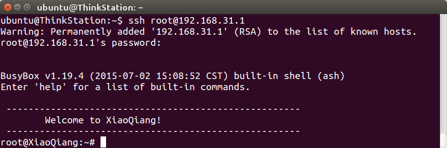
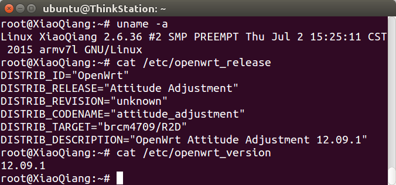
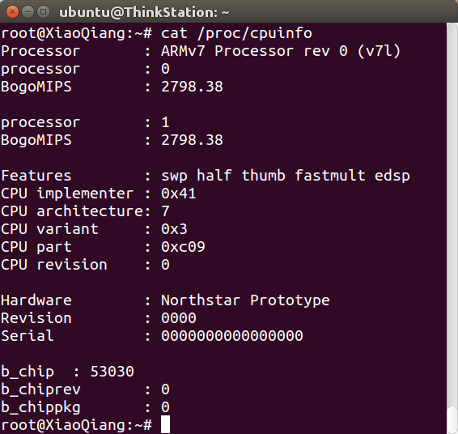
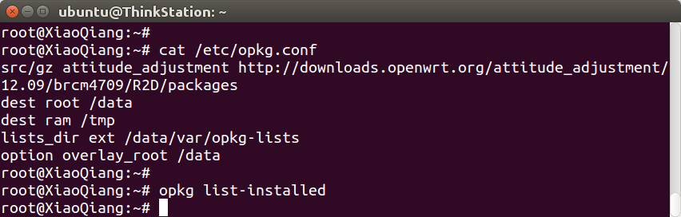
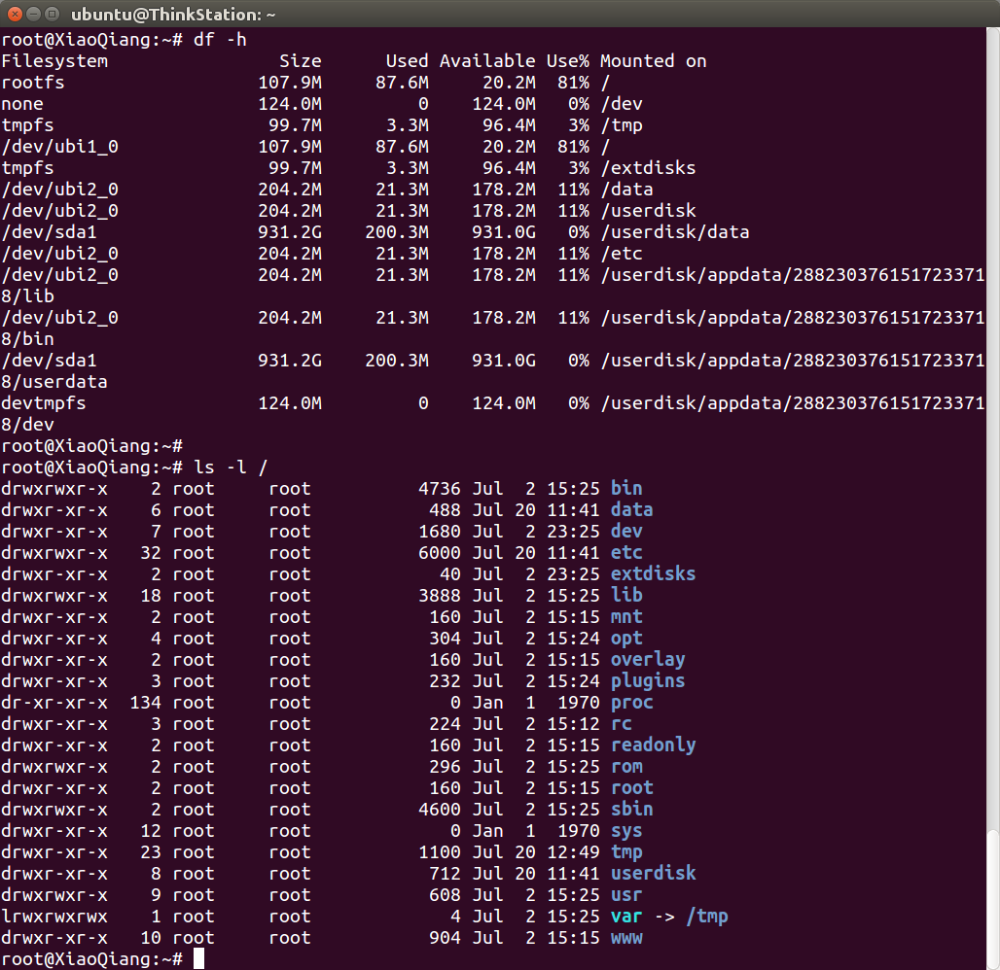
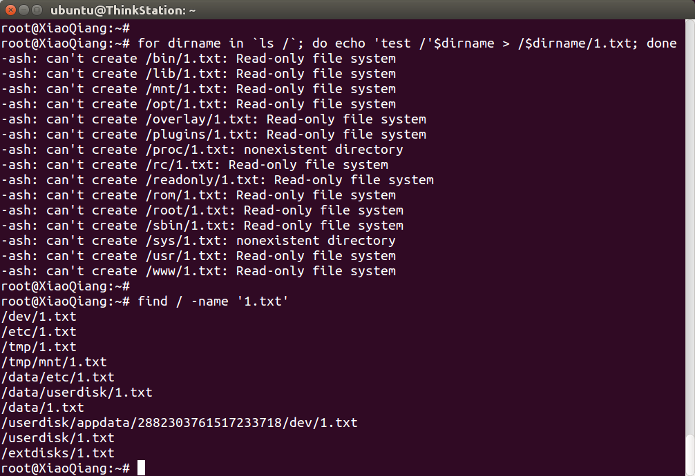
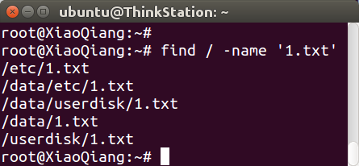

## 小米路由器固件下载

rom版本        | 小米路由器2（R2D） | 小米路由器1（R1D） | 小米路由器mini
---------------|--------------------|--------------------|---------------
2.5.17开发版   | | [下载](http://bigota.miwifi.com/xiaoqiang/rom/brcm4709_hdk_1ea3e_2.5.17.bin) |
2.5.16开发版   | [下载](http://bigota.miwifi.com/xiaoqiang/rom/r2d/brcm4709_r2d_ec5d6_2.5.16.bin) | |
2.3.51开发版   | | | [下载](http://bigota.miwifi.com/xiaoqiang/rom/r1cm/miwifi_r1cm_firmware_dce2f_2.3.51.bin)

## 小米路由 root

小米路由开放root，按照文档开启即可（[http://miwifi.com/miwifi_open.html](http://miwifi.com/miwifi_open.html)）。开启以后，ssh指令如下：

```
ssh root@192.168.31.1
```



## OpenWrt版本等系统信息

可以看到小米路由器2用的Linux内核还是很老的2.6.36，OpenWrt版本是很老的12.09.1。

```
uname -a
cat /etc/openwrt_release
cat /etc/openwrt_version
cat /proc/cpuinfo
```




## 官方 opkg 配置

可以看到小米路由器的opkg源为假地址，官方不提供opkg源，而且安装目录不是`/`，而是`/data`，难以安装自己下载的各种ipk。`opkg list-installed`为空，说明对opkg的支持很差，建议OpenWrt开发者不要购买。

```
src/gz attitude_adjustment http://downloads.openwrt.org/attitude_adjustment/12.09/brcm4709/R2D/packages
dest root /data
dest ram /tmp
lists_dir ext /data/var/opkg-lists
option overlay_root /data
```



## 分区信息和可写性测试

测试办法：往每个目录写入一个文件，重启检查是否丢失。

```
df -h
ls /
for dirname in `ls /`; do echo 'test /'$dirname > /$dirname/1.txt; done
find / -name '1.txt'
```




重启之后，还剩这些：



<div id="comments" data-thread-key="docs-miwifi"></div>
