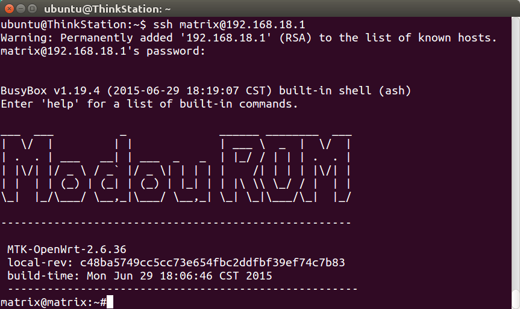
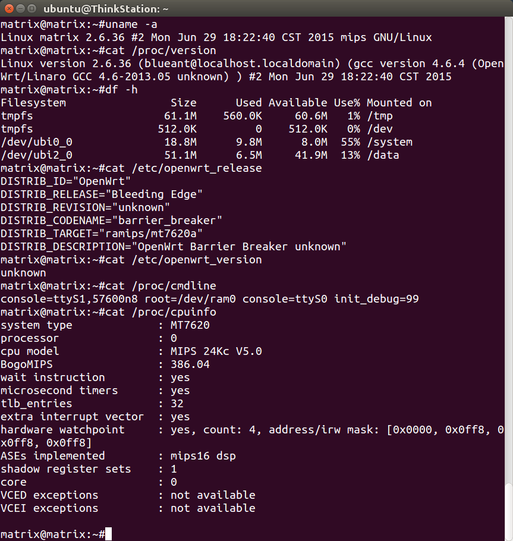
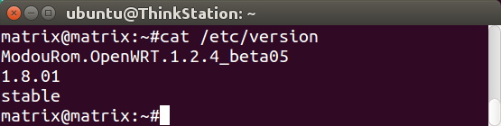
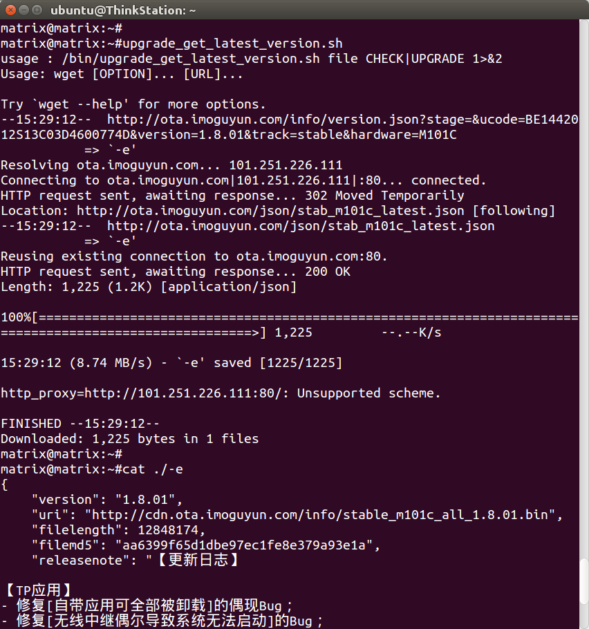
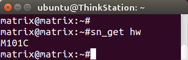

## 魔豆固件下载（内部版inter、 开发版main 和稳定版stable）

rom版本       | M101C硬件 | M101A硬件
--------------|-----------|----------
开发版 1.8.05 | [main_m101c_all_1.8.05.bin](http://cdn.ota.imoguyun.com/info/main_m101c_all_1.8.05.bin) | main_m101a_all_1.8.05.bin
开发版 1.8.04 | [main_m101c_all_1.8.04.bin](http://cdn.ota.imoguyun.com/info/main_m101c_all_1.8.04.bin) | main_m101a_all_1.8.04.bin
稳定版 1.8.01 | [stable_m101c_all_1.8.01.bin](http://cdn.ota.imoguyun.com/info/stable_m101c_all_1.8.01.bin) | stable_m101a_all_1.8.01.bin
稳定版 1.7.01 | [stable_m101c_all_1.7.01.bin](http://cdn.ota.imoguyun.com/info/stable_m101c_all_1.7.01.bin) | stable_m101a_all_1.7.01.bin
开发版 0.6.28 | | [main_m101a_all_0.6.28.bin](http://cdn.ota.imoguyun.com/info/main_m101a_all_0.6.28.bin)
稳定版 0.5.20 | | [stable_m101a_all_0.5.20.bin](http://ota.imoguyun.com/info/stable_m101a_all_0.5.20.bin)


## 魔豆 root

魔豆路由器开放root，按照文档开启即可（[http://bbs.modouwifi.cn/thread-8825-1-1.html）](http://bbs.modouwifi.cn/thread-8825-1-1.html)）。开启以后，ssh指令如下：

```
ssh matrix@192.168.18.1
```



## 分区、内核等系统信息



## 查看rom版本

```
cat /etc/version
```



## 检查最新rom版本

```
upgrade_get_latest_version.sh
```



## 查看设备型号（比如M101A、 M101C）

```
sn_get hw
```



## 手动升级rom

```
wget -O /data/upgrade/update.bin http://cdn.ota.imoguyun.com/info/main_m101c_all_1.8.05.bin
upgrade.sh . /data/upgrade/update.bin
reboot
```

## 魔豆 M101C kernel vermagic
rom            | kernel vermagic
---------------|------------------------------------------
1.8.05         | 2.6.36-1-556ed122e9e29dcbf944aed81514ec3d
1.8.01         | 2.6.36-1-556ed122e9e29dcbf944aed81514ec3d
1.7.01         | 2.6.36-1-c17fba68da07c209be57c5995a445463

<!-- 多说评论框 start -->
<div class="ds-thread" data-thread-key="docs-modou" data-title="魔豆" data-url="http://openwrt.io/docs/modou/"></div>
<!-- 多说评论框 end -->
