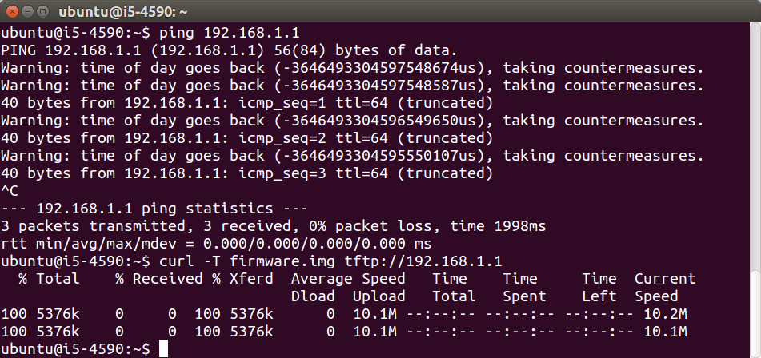
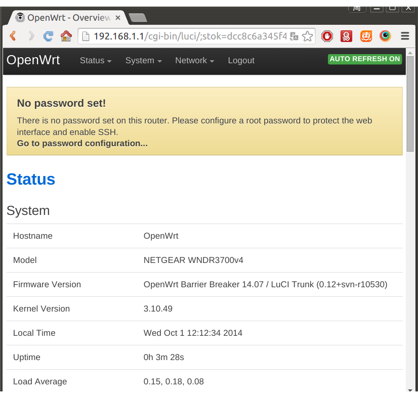

# netgear 网件

## WNDR3700 openwrt 刷机步骤

下载openwrt固件：

```
wget http://downloads.openwrt.io/barrier_breaker/14.07/ar71xx/nand/openwrt-ar71xx-nand-wndr3700v4-ubi-factory.img -O firmware.img
```

关机状态下，按住reset，开机，等待绿灯闪烁时，松开reset。把电脑设置成静态IP：192.168.1.x，然后把固件上传到路由器中，指令如下：

```
curl -T firmware.img tftp://192.168.1.1
```



会看到很多灯同时亮起，然后自动重启。刷机到此完成，即可telnet或http访问路由器。如图：




## 参考资料

Netgear WNDR3700 and WNDR37AV [http://wiki.openwrt.org/toh/netgear/wndr3700](http://wiki.openwrt.org/toh/netgear/wndr3700)

<!-- 多说评论框 start -->
<div class="ds-thread" data-thread-key="docs-netgear" data-title="网件" data-url="http://openwrt.io/docs/netgear/"></div>
<!-- 多说评论框 end -->
