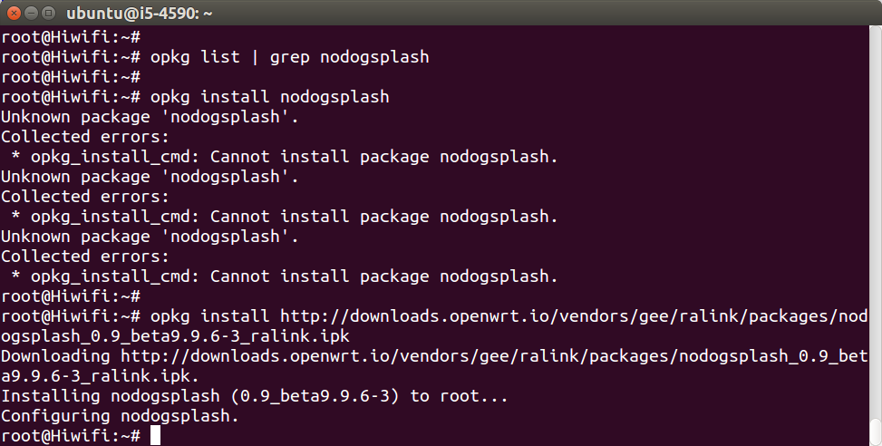
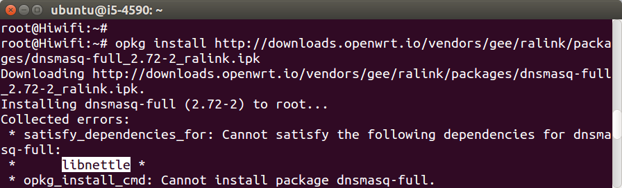
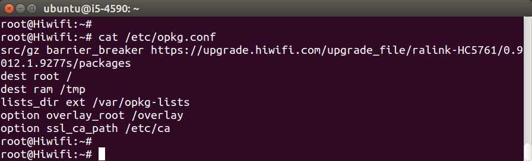

# opkg 软件源

## opkg install 自动安装

先查看本路由器安装了什么软件，软件源里有什么软件可以安装。命令如下：

```
opkg update
opkg list
opkg list-installed
```

尝试执行tcpdump，会报错“tcpdump: not found”，说明此软件没有安装。可自行安装，命令如下：

```
opkg install tcpdump
```

然后再执行，会发现成功了。命令如下：

```
tcpdump -i br-lan
```


可以发现opkg和Ubuntu的apt-get类似，是一个网络软件仓库，一行指令就能自动下载安装软件，非常方便。

## wget ipk 手动下载安装软件包

从上图中还能发现，opkg安装软件时会显示ipk下载链接，可以通过wget下载。尝试以下指令：

```
opkg remove tcpdump
wget http://upgradeipk.ikcd.net/upgrade_file/ralink-HC5761/0.9012.1.9277s/packages/tcpdump_4.2.1-20141110.1_ralink.ipk
opkg install ./tcpdump_4.2.1-20141110.1_ralink.ipk
```

可以看出opkg不止可以通过软件源安装软件，还可以安装本地文件。其实还可以不用下载，直接安装链接，指令如下：

```
opkg install http://downloads.openwrt.io/vendors/gee/ralink/packages/nodogsplash_0.9_beta9.9.6-3_ralink.ipk
```

像nodogsplash这种仓库里没有的软件，就需要手动下载安装。


下面尝试另一种情况，通过链接安装`dnsmasq-full`，指令如下：


```
opkg install http://downloads.openwrt.io/vendors/gee/ralink/packages/dnsmasq-full_2.72-2_ralink.ipk
```

安装失败，报错："satisfy\_dependencies\_for: Cannot satisfy the following dependencies for dnsmasq-full: libnettle"，如图：



这说明dnsmasq-full依赖libnettle，需要路由器里先安装它。解决办法是：在网上找到libnettle的下载链接，安装它，指令如下：

```
opkg install http://downloads.openwrt.io/vendors/gee/ralink/packages/libnettle_3.1.1-1_ralink.ipk
```

安装失败，报错："satisfy_dependencies_for: Cannot satisfy the following dependencies for libnettle:libgmp"。解决办法是：找到libgmp的下载链接，然后安装。

## 自定义opkg src软件源

通过上面的实验，发现两个问题：

 * opkg安装一个长长的链接，是难以记忆的。
 * 手动下载安装时，一旦出现连环依赖，会浪费大量的时间。

如果能把各种软件都放到opkg软件源里，那就方便了。先看看`/etc/opkg.conf`的默认内容：

```
cat /etc/opkg.conf
```



然后在`/etc/opkg.conf`和`/etc/opkg.d`里的每个文件都加入一行，指令如下：

```
echo 'src/gz openwrtio http://downloads.openwrt.io/vendors/gee/ralink/packages' >> /etc/opkg.conf
find /etc/opkg.d/ -name '*.conf' | xargs sed -i '2isrc/gz openwrt.io http://downloads.openwrt.io/vendors/gee/ralink/packages'
```

然后再尝试安装dnsmasq-full，指令如下：

```
opkg update
opkg install dnsmasq-full
```

安装失败，报错：“check_data_file_clashes: Package dnsmasq-full wants to install file /usr/sbin/dnsmasq But that file is already provided by package dnsmasq”，表示dnsmasq-full和系统以及安装的dnsmasq冲突：都需要写入`/usr/sbin/dnsmasq`文件。所以强制覆盖安装，重启软件即可，指令如下：

```
opkg
opkg install --force-overwrite dnsmasq-full
/etc/init.d/dnsmasq restart
```


## 开发环境

OpenWrt是Linux，所以开发使用Linux系统最方便。本文档使用Ubuntu系统，建议使用15.04 Desktop 64-bit或者14.04 Server 64-bit。如果用的是Windows，可以用免费的虚拟机Virtual Box\([virtualbox.org](https://www.virtualbox.org/)\)安装Ubuntu。

在Ubuntu系统中执行下列命令，安装依赖：

```
sudo apt-get install subversion build-essential libncurses5-dev zlib1g-dev gawk git ccache gettext libssl-dev xsltproc
```
