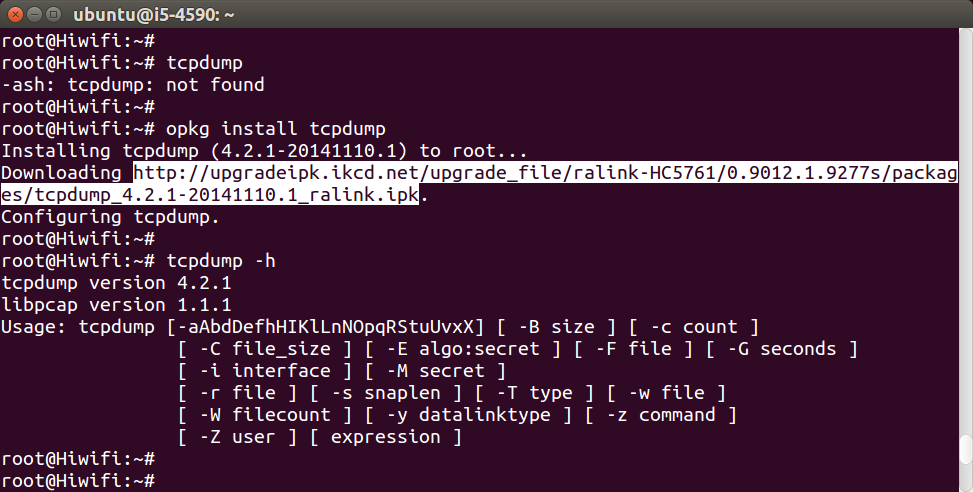
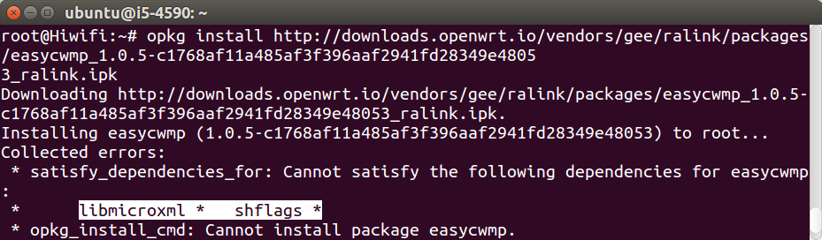
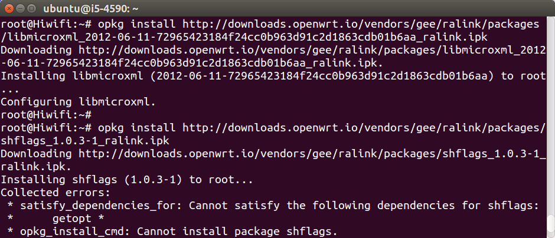
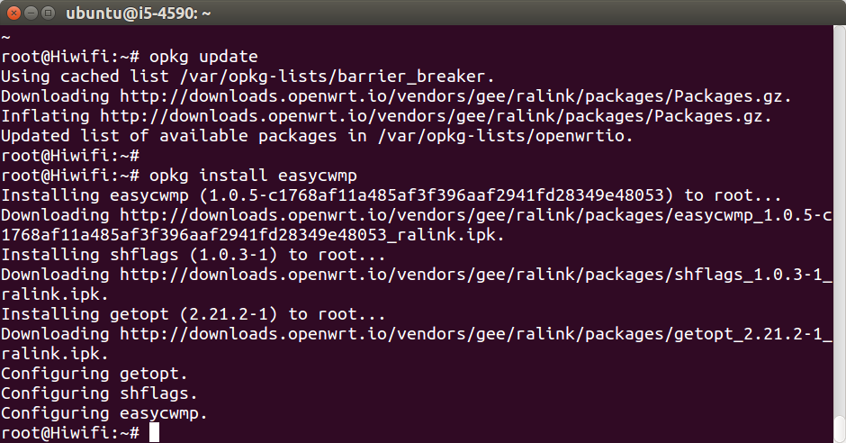

## opkg install 自动安装

先查看本路由器安装了什么软件，软件源里有什么软件可以安装。命令如下：

```
opkg update
opkg list-installed
opkg list
```

尝试执行tcpdump，会报错“tcpdump: not found”，说明此软件没有安装。可自行安装，命令如下：

```
opkg install tcpdump
```

然后再执行，会发现成功了。命令如下：

```
tcpdump -i br-lan
```



可以发现opkg和Ubuntu/Debian的apt类似，和macOS下的brew也类似，是一个网络软件仓库，一个命令就能自动下载安装软件，非常方便。如果对Ubuntu和macOS都不熟悉，请先自行学习一个，再来折腾路由器。

## wget ipk 手动下载安装

从上图中还能发现，opkg安装软件时会显示ipk下载链接，可以通过wget下载。尝试以下指令：

```
opkg remove tcpdump
wget http://upgradeipk.ikcd.net/upgrade_file/ralink-HC5761/0.9012.1.9277s/packages/tcpdump_4.2.1-20141110.1_ralink.ipk
opkg install ./tcpdump_4.2.1-20141110.1_ralink.ipk
```

可以看出opkg不止可以通过软件源安装软件，还可以安装本地ipk文件（ipk是OpenWrt的软件包格式）。其实还可以不用下载，直接安装链接，指令如下：

```
opkg install http://upgradeipk.ikcd.net/upgrade_file/ralink-HC5761/0.9012.1.9277s/packages/tcpdump_4.2.1-20141110.1_ralink.ipk
```

下面尝试另一种情况，通过链接安装`easycwmp`，指令如下：


```
opkg install http://dl.openwrt.io/vendors/gee/ralink/packages/easycwmp_1.0.5-c1768af11a485af3f396aaf2941fd28349e48053_ralink.ipk
```

安装失败，报错："satisfy\_dependencies\_for: Cannot satisfy the following dependencies for easycwmp: libmicroxml shflags"，如图：



这说明easycwmp依赖libmicroxml和shflags，需要先安装它们。解决办法是：在网上找到libmicroxml和shflags的下载链接，安装它，指令如下：

```
opkg install http://dl.openwrt.io/vendors/gee/ralink/packages/libmicroxml_2012-06-11-72965423184f24cc0b963d91c2d1863cdb01b6aa_ralink.ipk
opkg install http://dl.openwrt.io/vendors/gee/ralink/packages/shflags_1.0.3-1_ralink.ipk
```


可以看到libmicroxml安装成功，shflags报错："satisfy\_dependencies\_for: Cannot satisfy the following dependencies for shflags: getopt"。解决办法是：找到getopt的下载链接，然后安装。本文不再实验。

## 自定义opkg src软件源

通过上面的实验，发现两个问题：

 * opkg安装一个长长的链接，是难以记忆的。
 * 手动下载安装时，一旦出现连环依赖，会浪费大量的时间。

如果能把各种软件都放到opkg软件源里，那就方便了。先看看`/etc/opkg.conf`的默认内容：

```
cat /etc/opkg.conf
```


然后在`/etc/opkg.d`里的每个文件都加入一行，指令如下：

```
find /etc/opkg.d/ -name '*.conf' | xargs sed -i '2isrc/gz openwrtio http://dl.openwrt.io/vendors/gee/ralink/packages'
```

然后再尝试安装easycwmp，指令如下：

```
opkg update
opkg install easycwmp
```



经过这个实验发现opkg软件源是可修改的，然后就可以用opkg自动安装了，解决了依赖问题，非常方便。

## 常用的opkg软件源

### Openwrt.org opkg官方软件源

官方源：

```
src/gz openwrt_packages http://downloads.openwrt.org/chaos_calmer/15.05.1/ramips/mt7620/packages/packages
```

本站对官方源做了国内镜像CDN加速：

```
src/gz openwrt_packages http://downloads.openwrt.io/chaos_calmer/15.05.1/ramips/mt7620/packages/packages
```

### 极路由gee ralink opkg 源（j1s、 j2、 j3）

官方源：

```
src/gz barrier_breaker https://upgrade.hiwifi.com/upgrade_file/ralink-HC5661/0.9011.1.9228s/packages
src/gz barrier_breaker https://upgrade.hiwifi.com/upgrade_file/ralink-HC5761/0.9012.1.9277s/packages
src/gz barrier_breaker https://upgrade.hiwifi.com/upgrade_file/ralink-HC5861/0.9013.1.9653s/packages
```

本站源：

```
src/gz openwrtio http://dl.openwrt.io/vendors/gee/ralink/packages
```

### 极路由gee mediatek opkg 源（j1s新版 HC5661A）

官方源：

```
src/gz barrier_breaker https://upgrade.hiwifi.com/upgrade_file/mediatek-HC5661A/0.9011.1.9117s/packages
```

本站源：

```
src/gz openwrtio http://dl.openwrt.io/vendors/gee/mediatek/packages
```

### 极路由gee ar71xx opkg 源（j1）

官方源：

```
src/gz barrier_breaker https://upgrade.hiwifi.com/upgrade_file/ar71xx-HC6361/0.9008.2.8061s/packages
```

本站源：

```
src/gz openwrtio http://dl.openwrt.io/vendors/gee/ar71xx/packages
```

### 优酷 youku ramips opkg 源（YK-L1）

官方源：

```
src/gz youku http://desktop.youku.com/openwrt/1.5.0418.50280/2/mtn/packages
```

本站源：

```
src/gz openwrtio http://dl.openwrt.io/vendors/youku/ramips/packages
```

<div id="comments" data-thread-key="docs-opkg"></div>
