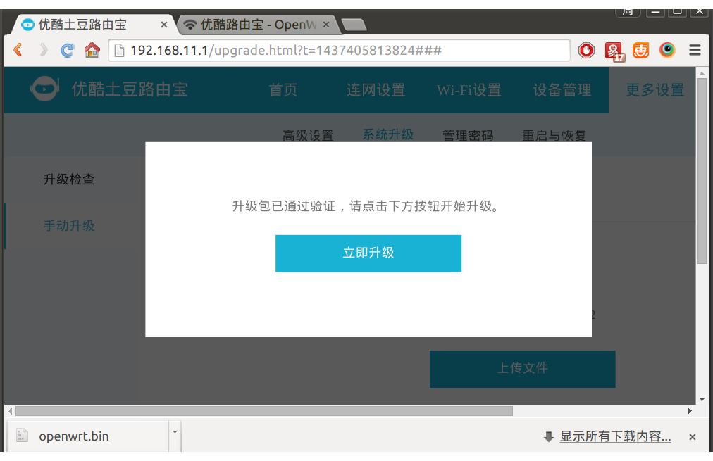
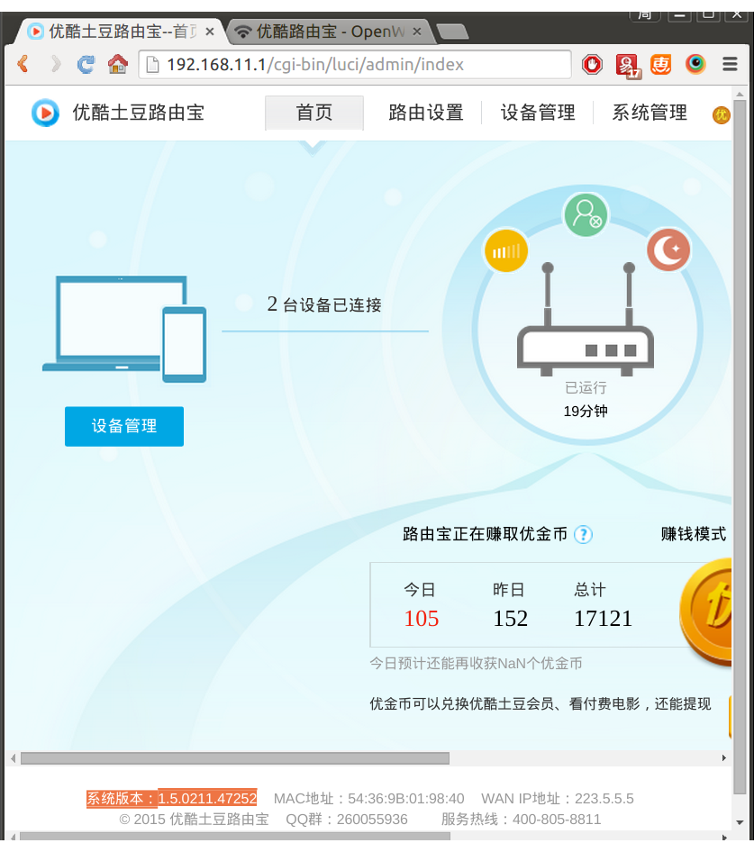
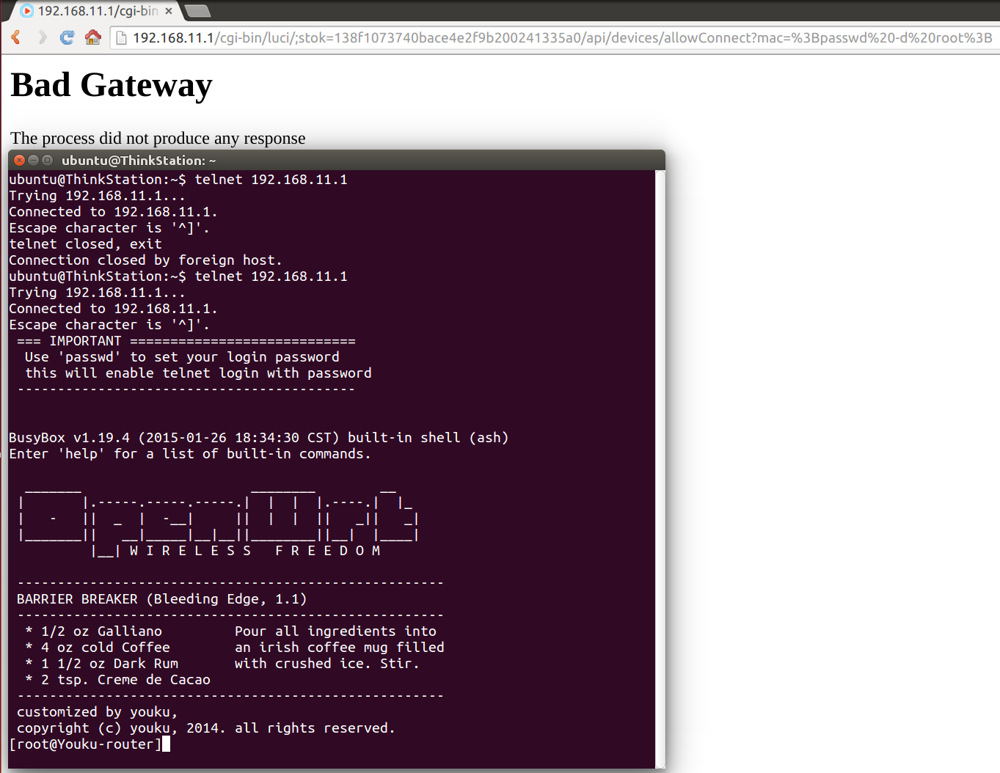
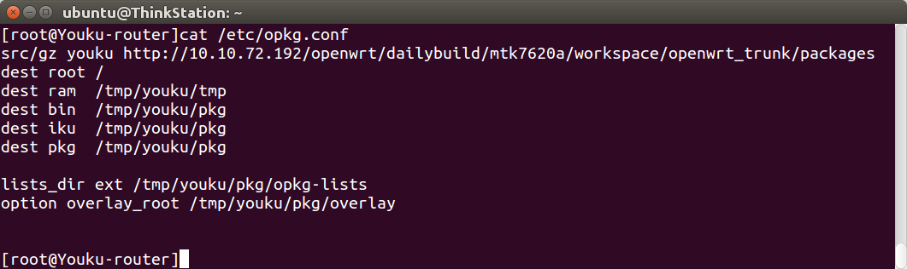
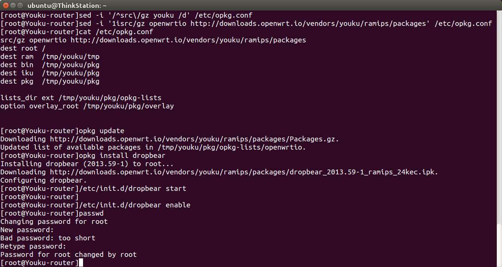
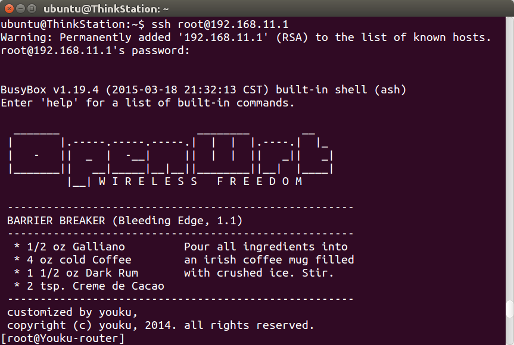
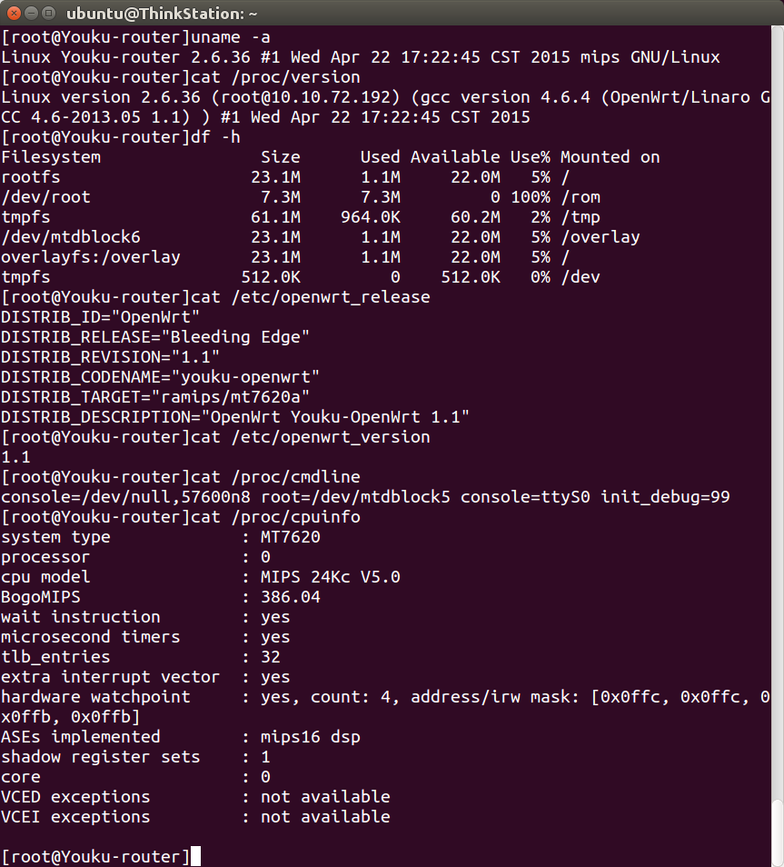
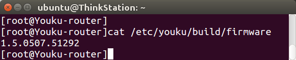

## 优酷土豆路由宝L1固件下载 youku rom downloads

rom版本 | 正式版硬件 | 公测版硬件
--------|--------|-------
2.0.0629.54182 | [下载](http://desktop.youku.com/openwrt/2.0.0629.54182/2/mtn/openwrt.bin) | [下载](http://desktop.youku.com/openwrt/2.0.0629.54182/1/mtn/openwrt.bin)
1.5.0507.51292 | [下载](http://desktop.youku.com/openwrt/1.5.0507.51292/2/mtn/openwrt.bin) |
1.5.0421.50378 | [下载](http://desktop.youku.com/openwrt/1.5.0421.50378/2/mtn/openwrt.bin) |
1.5.0417.50253 | [下载](http://desktop.youku.com/openwrt/1.5.0417.50253/2/mtn/openwrt.bin) | [下载](http://desktop.youku.com/openwrt/1.5.0417.50253/1/mtn/openwrt.bin)
1.5.0327.49004 | [下载](http://desktop.youku.com/openwrt/1.5.0327.49004/2/mtn/openwrt.bin) |
1.5.0327.48994 | | [下载](http://desktop.youku.com/openwrt/1.5.0327.48994/1/mtn/openwrt.bin)
1.5.0320.48610 | | [下载](http://desktop.youku.com/openwrt/1.5.0320.48610/1/mtn/openwrt.bin)
1.5.0211.47252 | [下载](http://desktop.youku.com/openwrt/1.5.0211.47252/2/mtn/openwrt.bin) |
1.5.0211.47226 | | [下载](http://desktop.youku.com/openwrt/1.5.0211.47226/1/mtn/openwrt.bin)

## 优酷 root

优酷目前尚未开放root，需要自行注入（[http://www.eehello.com/?post=183](http://www.eehello.com/?post=183)）或者找官方申请。注入步骤：下载旧版本固件（比如1.5.0211.47252），在路由器网页后台里手动升级（其实是降级），然后登录路由器网页后台，找到stok，拼成了一个链接，请求一次此链接，即可开启telnet。如图：




随便点一个链接，发现链接中出现stok即可。把注入语句加到后面，请求一次，如图：


```
http://192.168.11.1/cgi-bin/luci/;stok=138f1073740bace4e2f9b200241335a0/api/devices/allowConnect?mac=%3Bpasswd%20-d%20root%3B
```



然后即可使用telnet登录，命令如下：

```
telnet 192.168.11.1
```

然后修改`/etc/opkg.conf`，把无效的源删除，加入有效的源。然后安装dropbear并启动，即可开启ssh，还要给root设置密码，命令如下：

```
sed -i '/^src\/gz youku /d' /etc/opkg.conf
sed -i '1isrc/gz openwrtio http://downloads.openwrt.io/vendors/youku/ramips/packages' /etc/opkg.conf
opkg update
opkg install dropbear
/etc/init.d/dropbear start
/etc/init.d/dropbear enable
passwd
```



退出telnet。以后就可以使用ssh登录了，命令如下：

```
exit
ssh root@192.168.11.1
```


## 分区、内核等系统信息



## 查看rom版本

```
cat /etc/youku/build/firmware
```


## 优酷 YK-L1 kernel vermagic
rom            | YK-L1
---------------|------------------------------------------
1.5.0507.51292 | 2.6.36-1-14c532299308555749eb1db620b27288

<!-- 多说评论框 start -->
<div class="ds-thread" data-thread-key="docs-youku" data-title="优酷土豆路由宝" data-url="http://openwrt.io/docs/youku/"></div>
<!-- 多说评论框 end -->
